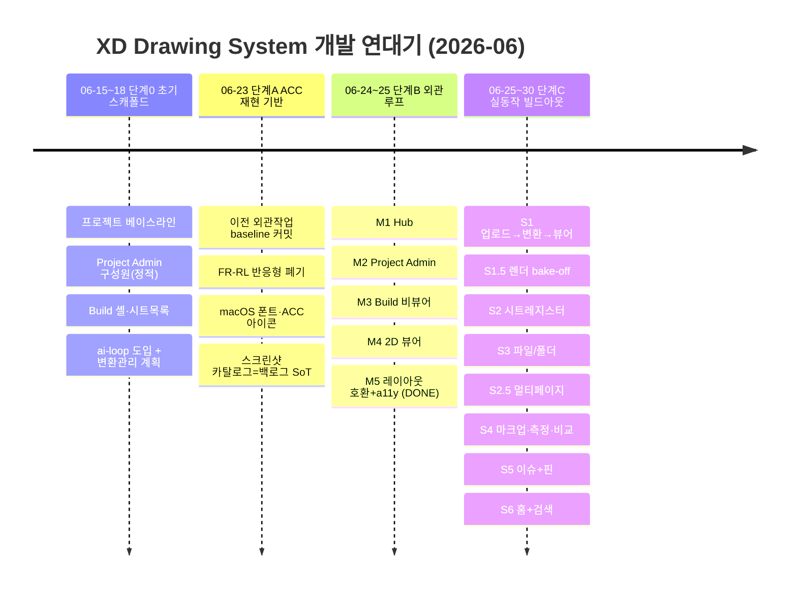
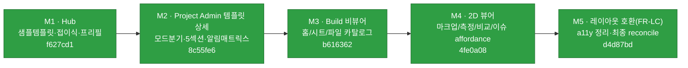
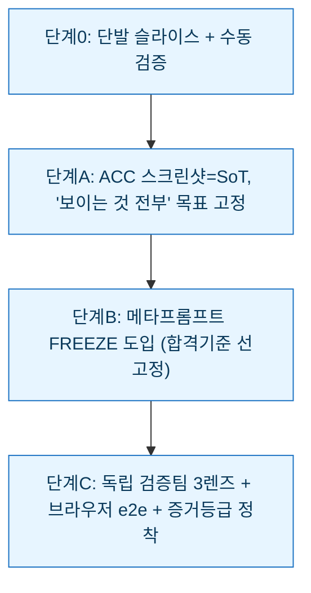

# XD Drawing System — 작업 연대기 (처음부터 지금까지)

> 프로젝트 탄생(2026-06-15)부터 현재(2026-06-30)까지 **어떻게 만들어 왔는지**를 시간순으로 정리한 문서.
> 현황 대시보드는 [`ROADMAP.md`](./ROADMAP.md), 상세 진행 SoT는 `docs/buildout-loop/PROGRESS.md`.
> 모든 항목은 실제 git 커밋(`git log`)에 근거한다.

---

## 한눈에 보는 4단계

이 프로젝트는 "정적 외관을 먼저 완성하고, 그 위에 실동작을 붙인다"는 전략으로 **4단계**를 거쳤다.

---

## 단계 0 — 프로젝트 탄생 & 초기 스캐폴드 (2026-06-15 ~ 06-18)

정적 React 앱으로 시작해 Hub·Project Admin·Build의 **뼈대 화면**을 세우고, 자기검증형 개발 방식(ai-loop)과 도면 변환관리 계획을 도입했다.

| 날짜 | 커밋 | 내용 |
|---|---|---|
| 06-15 | `054e754` | **Initial project baseline** — 프로젝트 최초 생성 |
| 06-17 | `2f20dc9` | 초기 setup 슬라이스 구현 |
| 06-17 | `9ac41aa`·`c6dafeb` | 로컬 ai-loop 스킬/스캐폴드 도입 |
| 06-17 | `8b50c02`→`16ea78b`→`c8fe233`→`17259c2` | **Project Admin 구성원 액세스**(정적 데이터·검색/선택·모달·목록에서 열기) |
| 06-17 | `a7125c0` | ai-loop 모드 디스패치 |
| 06-18 | `3d418e1` | **Build 셸 + 시트 목록**(정적) |
| 06-18 | `013b491` | **DWG/DXF 업로드·변환 관리 설계**(이후 S1의 씨앗) |
| 06-18 | `c3022d9`·`a927459`·`75f3351` | blocker 처리·ACC 뷰어 계획·세션 종료 handoff |

> 이 단계의 결과물은 **클릭은 되지만 데이터·연산·영속이 없는 정적 외관**이었다.

---

## 단계 A — ACC 픽셀 재현 기반 다지기 (2026-06-23)

"무엇을 만들지"의 기준을 **실제 ACC 스크린샷**으로 못박고, 과도했던 반응형 프레임워크를 걷어내 토대를 안정화했다.

| 커밋 | 내용 |
|---|---|
| `717f559` | 이전 세션의 ACC 재현·외관 작업을 baseline으로 커밋 |
| `cf5289d` | **FR-RL 반응형 프레임워크 폐기** — 해상도 매트릭스 대신 FHD/4K/macOS 무파손만 유지 |
| `ec36a0b`·`815479c` | macOS 안전 폰트 스택·스크롤바 거터·좌측 네비 아이콘 ACC 일치 |
| `fa1872d`·`c655060` | **ACC 캡처 53장 git 추적 + `docs/Screenshot_Feature_Catalog.md`를 기능 백로그 SoT로** 확정 |

> 핵심 결정: "보이는 기능 전부 구현"을 목표로, ACC 스크린샷이 **진실의 원천(SoT)**이 됨.

---

## 단계 B — 외관 완성 루프 `appearance-loop` (2026-06-24 ~ 06-25) · M1~M5 DONE

스크린샷 카탈로그를 기준으로 **외관을 픽셀 수준까지 완성**한 루프. 메타프롬프트 freeze → 구현 → 검증의 ai-loop를 본격 적용했다.

| 커밋 | 내용 |
|---|---|
| `7ec0c38` | appearance-loop 프레이밍(LOOP/PLAN/PROGRESS/CHECKS) |
| `f627cd1` | **M1** Hub 외관 — 샘플 템플릿 use-action·접이식·prefill |
| `8c55fe6` | **M2** Project Admin 템플릿 상세 — 모드분기·5섹션·알림 매트릭스 3단 계층 |
| `b616362` | **M3** Build 비뷰어 — 화면별 분할 + 홈/시트/파일 카탈로그 보강 |
| `4fe0a08` | **M4** 2D 뷰어 — 마크업/측정/비교/이슈 affordance(외관) |
| `d4d87bd` | **M5** 횡단 레이아웃 호환(FR-LC) + a11y 부채 정리 + 최종 reconcile → **외관 루프 DONE** |

> 결과: 17개 화면이 ACC와 시각적으로 일치. 단, 여전히 "그려진 affordance"일 뿐 실제 동작은 없었다 → 다음 루프의 출발점.

---

## 단계 C — 실동작 빌드아웃 루프 `buildout-loop` (2026-06-25 ~ 06-30) · S1~S6 DONE

외관에 **실제 백엔드·변환·연산·영속**을 붙이는 수직 슬라이스. 자매 프로젝트 `Study_TypeDB`의 동작 백엔드를 **이식하되 런타임 비의존**으로 독립 구동.

| 슬라이스 | 커밋 | 무엇을 했나 | 핵심 결정/사건 |
|---|---|---|---|
| **S1** | `e146fc8`·`f7b1a99` | FastAPI 백엔드 부트스트랩 + 업로드→변환(ODA/ezdxf/PyMuPDF)→뷰어 end-to-end | 독립검증이 2 BLOCKER(JSON race·traversal) 적발→수리, TypeDB 3.7 활성화 |
| **S1.5** | `2284512` | 렌더 엔진 2-way bake-off | **APS는 비종속 전략 위배로 제외**, ②벡터 canvas2D 승자 채택(무손실 줌·레이어 토글) |
| **S2** | `877518d` | 시트 레지스터 — PDF 페이지 분할 + 시트목록 실데이터 완전 교체 | 정적 시드 제거, 타이틀블록 휴리스틱 추출 |
| **S3** | `dbb1b6f` | 파일/폴더 관리 — 폴더 CRUD + 명시적 버전세트 + 권한 메타 | 인증/RBAC 강제는 S7로 명시 이연(표시까지만) |
| **S2.5** | `82ae45f` | 멀티페이지 스케일 강건화 | **실측(제주 BESS 68p/94MB)로 도출** — 번호추출 0%→98%, S3 뒤에 삽입 |
| **S4** | `0051f87` | 마크업·측정·시트비교 실연산+영속 | 좌표 이중트랙(벡터 world + PDF image), 2026-06-29 사용자 범위 정정 반영 |
| **S5** | `83996d9` | 이슈 영속 + 뷰어 핀 연계 | 독립 Issue 엔티티·ACC식 상태 4종·양방향 딥링크, 3렌즈가 MAJOR(PATCH 핀-위치) 적발→수리 |
| **S6** | `776ae88` | 홈 위젯 실데이터 + 전역 검색 | 정직한 빈 상태·이슈 차트(의존성0)·`/api/search` 교차+딥링크, 3렌즈가 MAJOR(GET seed 부작용) 적발→수리 |

> 각 슬라이스는 **공동설계 freeze → 구현 → 자동게이트 → 독립 3렌즈 → 수리 → 브라우저 e2e → reconcile → 커밋**의 동일 루프를 거쳤다(상세 [`ROADMAP.md` §3](./ROADMAP.md)).

---

## 일하는 방식의 진화 (메타)

처음부터 지금까지 **작업 방식 자체도 함께 다듬어졌다**:

- **단계0**: ai-loop 스캐폴드 도입, 그러나 아직 단발성.
- **단계A**: "무엇이 정답인가"를 ACC 스크린샷으로 고정 → 주관 제거.
- **단계B**: 구현 **전에** acceptance를 freeze하고 도중에 안 바꾸는 규율 정착.
- **단계C**: 적대적 백엔드·프론트 a11y·Done-When 비평가 **3렌즈 병렬 검증** + 실 device e2e + 증거등급(A/B/C/D)으로 "주장이 아닌 증거"로 합격 판정.

---

## 지금, 그리고 다음

- **완료**: 단계0~B 전부 + 단계C의 S1~S6 (빌드아웃 80%).
- **다음**: **S7 인증/RBAC + 구성원 영속** 착수 — `prompts/09` 공동설계부터(프로덕션 auth는 HUMAN_GATE). 이후 **S8 온톨로지+AI**(AI는 HUMAN_GATE).
- 전체 현황·아키텍처·잔여 작업량은 [`ROADMAP.md`](./ROADMAP.md) 참조.
