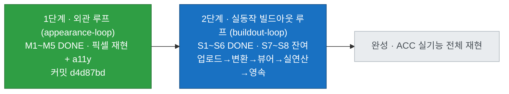
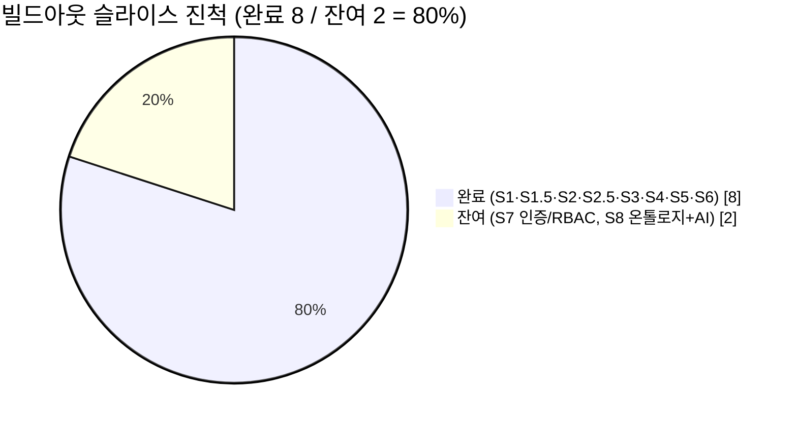
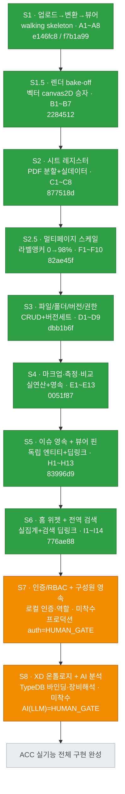
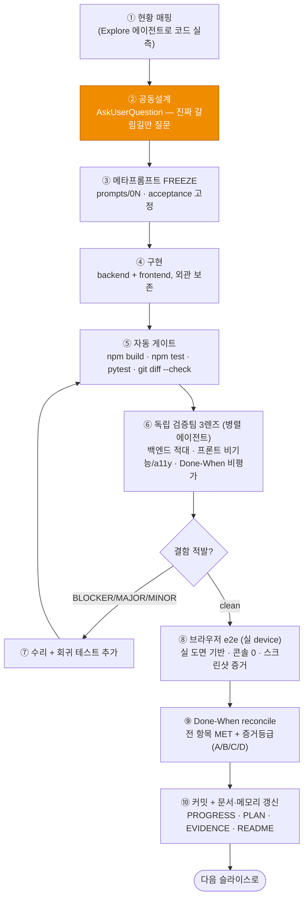
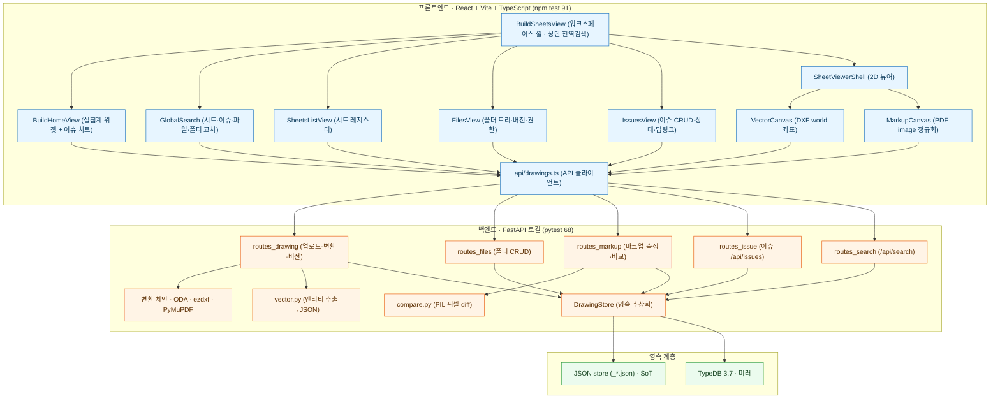
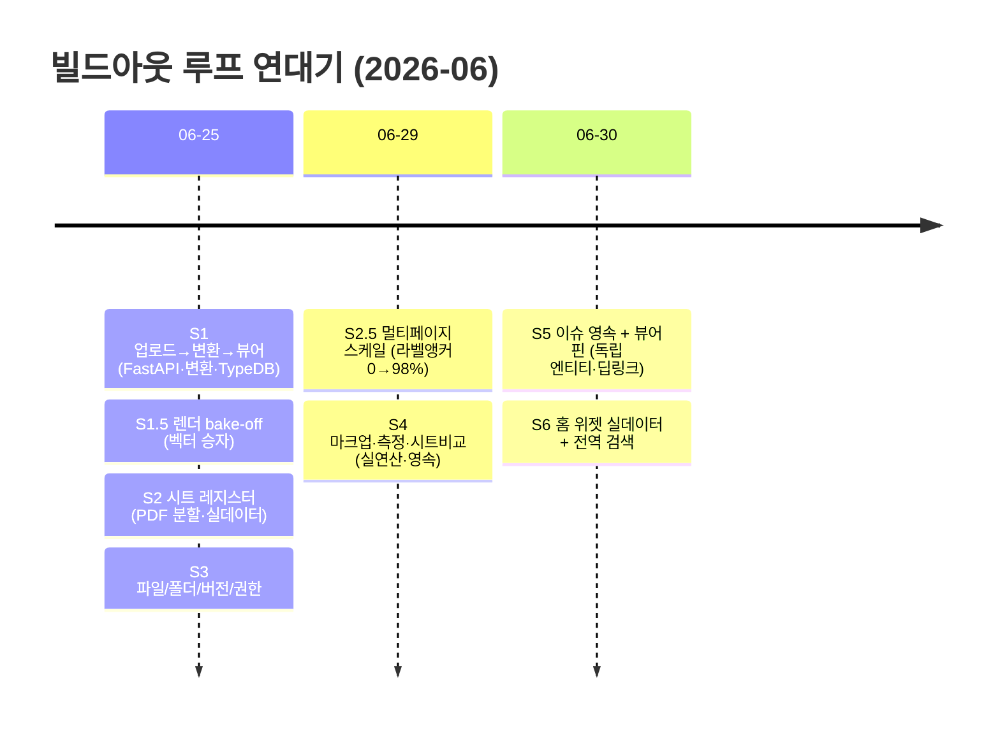

# XD Drawing System — 작업 로드맵 & 현황 (검수용 대시보드)

> ⚠️ **STALE (세션7 무렵에서 멈춤).** 이 파일은 S7 인증까지만 반영하며 세션18~29의 대화형 액션·지식그래프 트랙이 없다. **최신 진행·남은 일 SoT = 제안 vault `_개발-브릿지.md` §2(🗺️ 지식그래프 로드맵) + dev `docs/buildout-loop/PROGRESS.md`(세션별 로그) + `docs/superpowers/specs·plans/`.** 재작성 전까지 이 문서로 다음 작업을 판단하지 말 것.

> 이 파일은 사용자가 **전체 작업량·진척·과정·결과**를 한눈에 보고 검수하기 위한 시각 대시보드다.
> 사실 기준: `docs/buildout-loop/PROGRESS.md` · `PLAN.md` · `EVIDENCE.md` (2026-06-30 기준).
> 정밀 근거는 그 문서들이 SoT이고, 이 파일은 그 위의 **지도**다.
> 프로젝트 탄생부터의 전체 시간순 서사는 [`HISTORY.md`](./HISTORY.md) 참조.

---

## 0. 큰 그림 — 두 개의 루프

프로젝트는 ACC(Autodesk Construction Cloud) Build를 참고한 XD 도면관리 시스템이며, **두 단계 루프**로 진행됐다.

- **1단계(완료)**: 정적 외관(UI)을 ACC 스크린샷과 픽셀 수준으로 재현. `docs/appearance-loop/`.
- **2단계(진행 중)**: 그 외관에 **실제 동작·연산·영속**을 붙이는 수직 슬라이스. `docs/buildout-loop/`. ← **지금 여기**

---

## 1. 진척 현황 — 한눈에

빌드아웃 루프는 총 **10개 수직 슬라이스**로 분해됐고, 그중 **8개 완료 / 2개 잔여**다.

---

## 2. 마일스톤 로드맵 (계획 순서 + 상태)

녹색=완료, 파랑=다음, 회색=대기, 주황=HUMAN_GATE(사용자 승인 필요).

**남은 작업량 요약**
- **S7 (중간 규모)**: 로컬 인증 + 역할(관리자/편집자/뷰어), `projectAdminData` 정적→영속, 권한이 화면에 실제 반영. *프로덕션급 인증 도입은 전략 변경이라 사용자 승인 게이트.*
- **S8 (큰 규모 + 게이트)**: 도면 entity를 TypeDB에 적재해 장비 온톨로지 해석, `equipmentEntityId` 바인딩. *AI(LLM) 분석은 비용/방향 결정이 필요한 HUMAN_GATE.*
- 그 외 누적된 **비차단 후속 부채**(각 슬라이스 EVIDENCE 하단)는 본 마일스톤들과 별개로 정리 대상.

---

## 3. 작업 프로세스 — "내가 어떻게 일하는가" (검수 포인트)

각 슬라이스는 아래 **ai-loop 계약**을 동일하게 거친다. 합격 기준(acceptance)은 구현 **전에 FREEZE**되고, 합격을 위해 도중에 기준을 바꾸지 않는다(기준 변경=사용자 게이트). 그래서 사용자가 "무엇을 약속했고 무엇이 검증됐는지" 추적할 수 있다.

> **검수 팁**: 어떤 슬라이스든 `docs/buildout-loop/EVIDENCE.md`에서 그 섹션을 열면 ⑤게이트 결과·⑥3렌즈 적발/수리·⑧e2e 스크린샷·⑨reconcile 표가 항목별로 다 적혀 있다. "주장"이 아니라 "증거+등급"으로 본다.

---

## 4. 무엇을 만들었나 — 시스템 아키텍처 (결과물)

정적 외관에서 시작해, 아래의 **로컬 풀스택**을 실제로 구축했다(외부 클라우드 비종속).

---

## 5. 작업 연대기 (실제 실행 순서)

번호 순서(계획)와 달리 S2.5는 실측 도출로 S3 뒤에 삽입됐다. 실제 날짜 기준:

---

## 6. 슬라이스별 산출물·검증 요약 (검수 표)

| 슬라이스 | 핵심 내용 | 대표 산출물 | 검증(acceptance) | 커밋 | 상태 |
|---|---|---|---|---|---|
| **S1** | 업로드→변환→뷰어 end-to-end | `backend/` FastAPI·DrawingStore·변환체인 | A1~A8 MET | e146fc8·f7b1a99 | ✅ |
| **S1.5** | 렌더 엔진 2-way bake-off | `vector.py`·`VectorCanvas` (벡터 승자) | B1~B7 MET | 2284512 | ✅ |
| **S2** | 시트 레지스터 (실데이터 교체) | `sheet_meta.py`·`BuildSheetsView` | C1~C8 MET | 877518d | ✅ |
| **S2.5** | 멀티페이지 스케일 강건화 | 좌표 라벨앵커·클라 페이지네이션 | F1~F10 MET | 82ae45f | ✅ |
| **S3** | 파일/폴더/버전/권한 | `routes_files.py`·`FilesView` 개편 | D1~D9 MET | dbb1b6f | ✅ |
| **S4** | 마크업·측정·시트비교 실연산 | `compare.py`·`geometry.ts`·이중 좌표트랙 | E1~E13 MET | 0051f87 | ✅ |
| **S5** | 이슈 영속 + 뷰어 핀 연계 | `routes_issue.py`·world/image 핀·딥링크 | H1~H13 MET | 83996d9 | ✅ |
| **S6** | 홈 위젯 실데이터 + 전역 검색 | `routes_search.py`·`homeStats.ts`·`GlobalSearch` | I1~I14 MET | 776ae88 | ✅ |
| **S7** | 인증/RBAC + 구성원 영속 | (예정) 로컬 인증·역할·`projectAdminData` 영속 | 미정 | — | ⏳ 게이트 |
| **S8** | XD 온톨로지 + AI 분석 | (예정) TypeDB 바인딩·장비해석·LLM | 미정 | — | ⏳ 게이트 |

**누적 검증**: acceptance **82개 항목** 전부 MET · 테스트 **npm 91 / pytest 68** PASS · 매 슬라이스 독립 3렌즈 + 브라우저 e2e(콘솔 0) · 8개 슬라이스 전부 커밋됨.

---

## 7. 지금 위치 & 다음 한 걸음

- **위치**: S6까지 완료 = 빌드아웃 루프 **80%**. 도면을 올리고→보고→그리고/재고→이슈로 관리하고→홈에서 집계·검색하는 **운영 워크플로 전체가 실동작**한다.
- **다음**: **S7 인증/RBAC** — `docs/buildout-loop/prompts/09` 공동설계(AskUserQuestion) freeze부터. 프로덕션 인증은 사용자 승인이 필요한 게이트이므로, 시작 시 범위(로컬 모의 인증 vs 실제 auth)를 먼저 확정한다.
- **재기동법**: `backend/.venv/Scripts/python.exe`(64bit) `XD_STORE=auto` uvicorn 8000 + `npm run dev` 5173 (상세 `PROGRESS.md` 세션6 블록).
