# XD 도면관리 시스템 — 기능 소개 (보고서용 스크린샷 세트)

> 촬영일: 2026-07-06 · 해상도 2560×1362 · 데이터: **LS 청주사업장 실제 전기도면 40장**
> 이 폴더(`보고서_2026-07-06/`)만 있으면 다른 곳에서 보고서를 작성할 수 있도록 스크린샷 + 설명을 자기완결형으로 정리했습니다.
> 스크린샷 원본은 `screenshots/` 하위에 있습니다.

---

## 0. 한눈에 보기 — 이 시스템은 무엇인가

Autodesk Construction Cloud(ACC) Build 화면을 벤치마크로, **도면관리 + 협업 + 설비 지식(온톨로지) + AI 어시스턴트**를 하나로 묶은 XD 제품군용 도면관리 시스템입니다.
이번 세트는 데모 데이터가 아니라 **LS 청주사업장 신축 전기도면 40장(EE-00-001 ~ EE-05-005)** 실데이터로 촬영했으며, AI가 이 실데이터에 **그라운딩(근거 기반 응답)**하는 것까지 포함합니다.

**대표 수치 (청주사업장):** 전기도면 40장 · 파일 40 · 폴더 11 · 저장 31.2 MB · 이슈 10 · 작업 6 · 점검 양식 4 · 등록 설비 15종

---

## 1. 프로젝트 허브 — 프로젝트 목록

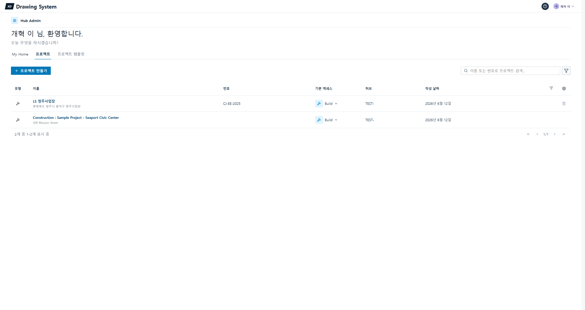

- ACC의 프로젝트 목록 화면을 재현. **LS 청주사업장(CJ-EE-2025, 충청북도 청주시 흥덕구)** 프로젝트가 등록되어 있습니다.
- 유형·이름·번호·기본 액세스·허브·작성일 컬럼, 프로젝트 검색/필터/컬럼 설정, 프로젝트 만들기.
- **보고서 포인트:** 다중 프로젝트/허브 구조를 갖춘 엔터프라이즈 SaaS 형태의 진입점.

---

## 2. Build 홈 — 프로젝트 대시보드

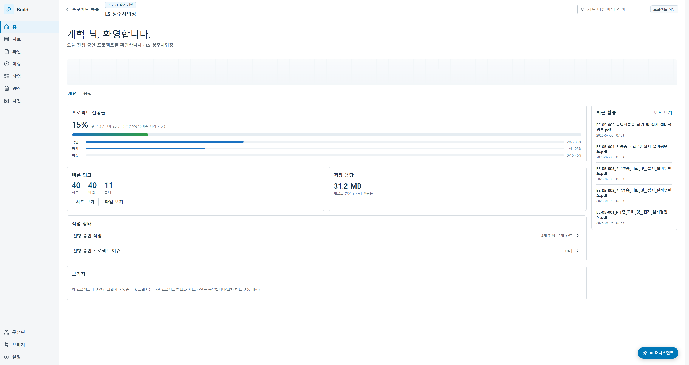

- 프로젝트 진행률(작업·양식·이슈 처리 기준 **15% = 3/20**), 빠른 링크(**시트 40 · 파일 40 · 폴더 11**), **저장 용량 31.2 MB**, 작업 상태(4 진행/2 완료), 이슈 10, 최근 활동(실제 청주 PDF 업로드 이력).
- 모든 숫자가 하드코딩이 아니라 **백엔드 실데이터 집계**입니다.

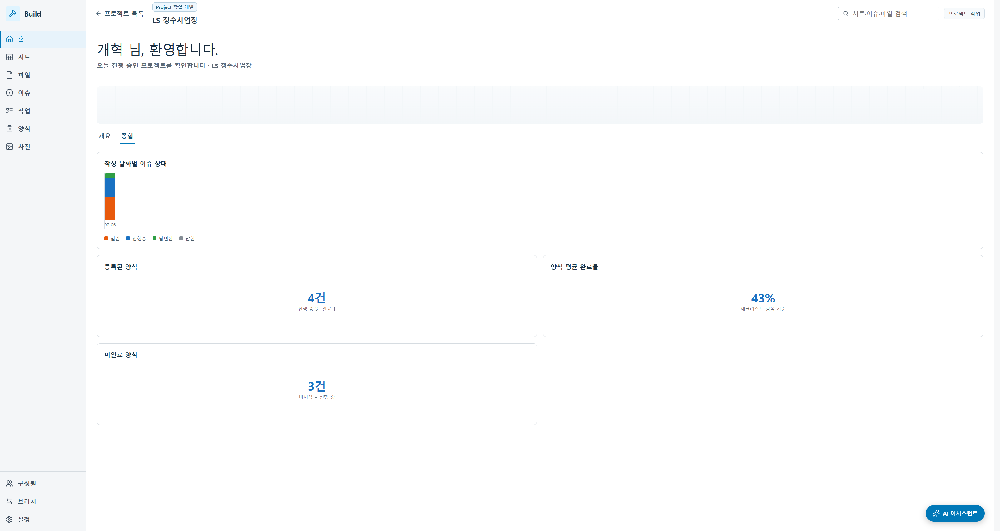

- '종합' 탭: 이슈 분포 차트 등 분석 뷰(의존성 라이브러리 없이 SVG/CSS로 구현).
- **보고서 포인트:** 프로젝트 상태를 한 화면에서 파악하는 관리자 대시보드.

---

## 3. 시트 레지스터 — 도면 목록

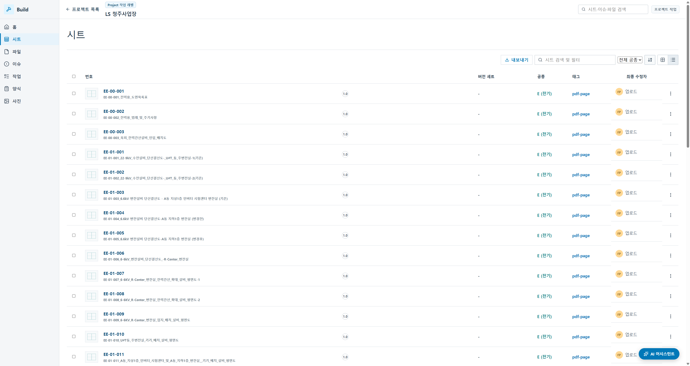

- **청주 전기도면 40장 전량**이 시트로 등록(EE-00-001 도면목록표 ~ EE-05-005 옥탑지붕층 피뢰·접지). 전부 공종 **E(전기)**.
- 업로드된 PDF를 페이지 단위로 분할하고 **타이틀블록에서 도면번호·제목을 자동 추출**(휴리스틱). 검색·공종 필터·번호 자연정렬·격자/목록 보기·버전 세트·태그.
- **보고서 포인트:** 실제 현장 도면을 그대로 반입해 시트로 카탈로그화하는 핵심 기능. 정적 시드가 아닌 **실 PDF 파생 데이터**.

---

## 4. 2D 도면 뷰어 + 마크업

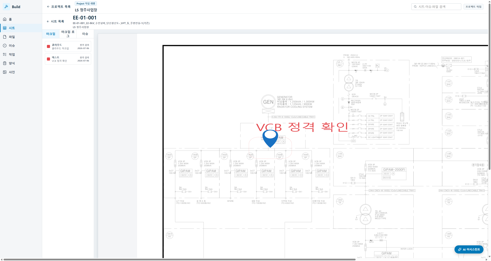

- 단선결선도 **EE-01-001(22.9kV 수전설비, U#T동 주변전실)**을 렌더. 기존 마크업(클라우드 강조·"VCB 정격 확인" 텍스트)이 저장·복원됩니다.
- 마크업 도구 10종: 선택·텍스트·도형·클라우드·폴리라인·다각형·펜·지우개·이슈 핀·측정. 하단 40시트 **필름스트립**으로 빠른 이동.
- 벡터(무손실 줌·레이어 토글)/래스터 렌더 엔진, 실척 측정(선형/면적/지름), 버전 비교 오버레이 지원.

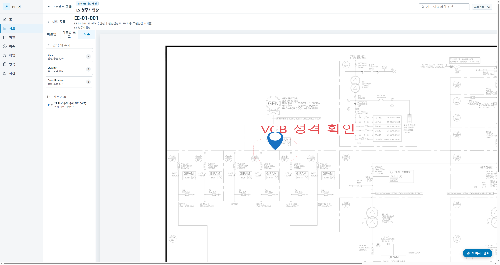

- 뷰어 안의 '이슈' 탭 — 도면 위 좌표에 고정된 **이슈 핀**과 이슈 목록이 연동됩니다.
- **보고서 포인트:** 도면 위에서 직접 검토·소통하는 협업 캔버스. 마크업·측정·핀이 모두 좌표 기반으로 영속.

---

## 5. 이슈 관리

- 청주 현장 실이슈 **10건**. 분류(협의·간섭·설계 검토·현장 확인)·상태(열림/진행중/답변됨/닫힘)·핀 연결이 표시됩니다.
- 예: "22.9kV 수전 주차단기(VCB) 정격 표기 확인 필요", "지상1층 케이블 트레이와 급기덕트 간섭 — 유효고 부족", "동력 결선도 접지 계통(TN-S) 주접지선 굵기 미표기".

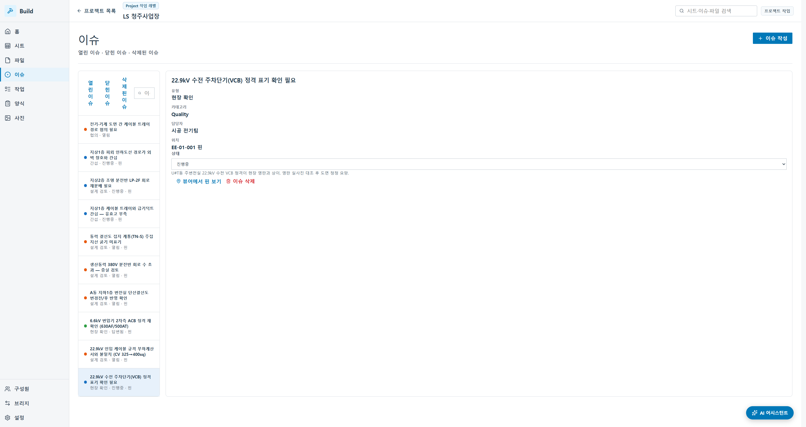

- 상세 인스펙터: 유형·카테고리(Quality 등)·담당자·**위치(EE-01-001 핀)**·상태 변경 드롭다운·설명·**"뷰어에서 핀 보기" 딥링크**.
- **보고서 포인트:** 도면↔이슈 양방향 점프. 실제 전기 설계·시공 검토 항목을 그대로 담은 이슈 트래킹.

---

## 6. 파일 · 폴더 관리 + 버전

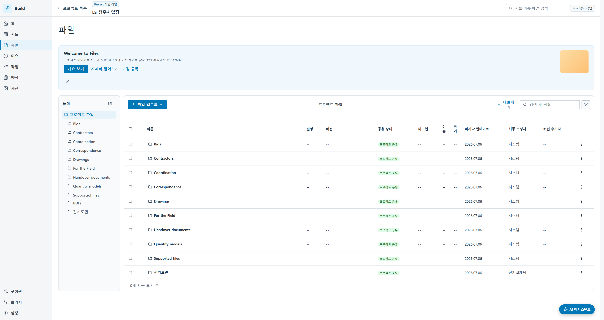

- ACC식 폴더 트리(Bids·Contractors·Coordination·Drawings·PDFs 등 기본 폴더) + 현장 폴더 **전기도면**. 폴더 CRUD·업로드·공유 메타.

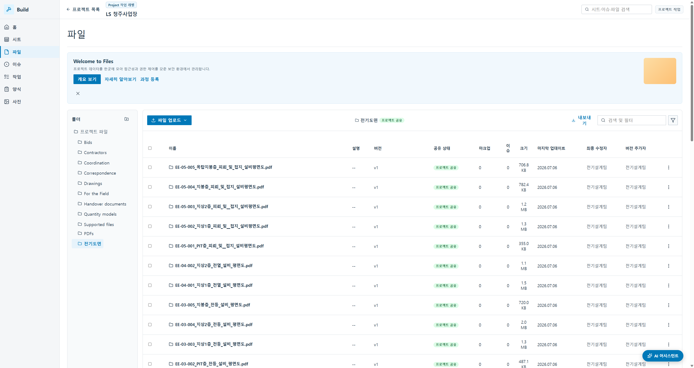

- '전기도면' 폴더 안에 **청주 실 PDF 40개**(EE-00-001 ~ EE-05-005). 파일별 용량(355 KB ~ 2.0 MB)·버전·공유 상태·마크업/이슈 수·최종 수정자(전기설계팀).
- **보고서 포인트:** 명시적 **버전 세트**(보관·이력·최신 1행)로 도면 개정 이력을 추적. 실제 파일이 서버에 저장·다운로드 가능.

---

## 7. 사진 갤러리

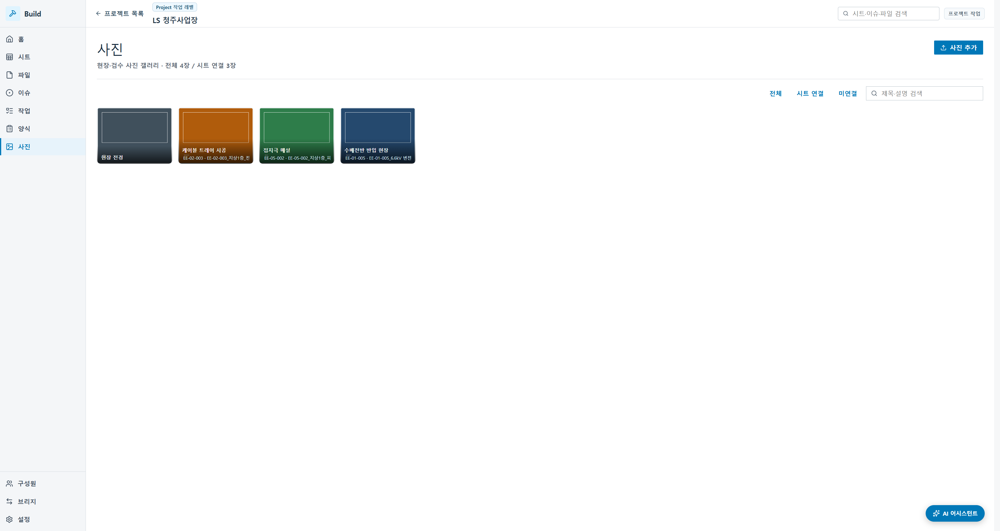

- 현장·검수 사진 **4장**(현장 전경·케이블 트레이 시공·접지극 매설·수배전반 반입). 시트 연결·미연결 필터, 라이트박스 확대.
- **보고서 포인트:** 현장 기록을 도면·이슈와 엮는 시각 자료 관리.

---

## 8. 작업(Task) 관리

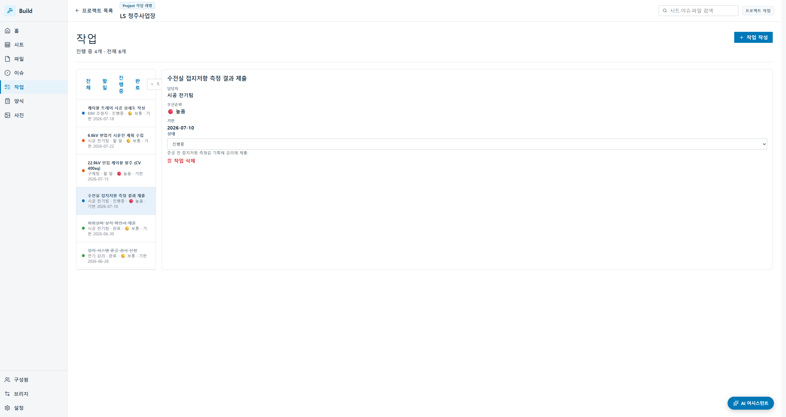

- 청주 실작업 **6건**(케이블 트레이 상세도 작성·6.6kV 변압기 시운전 계획·22.9kV 인입 케이블 발주·수전실 접지저항 측정·피뢰설비 설치 확인서·접지 시스템 준공 검사).
- 담당(BIM 조정자·시공 전기팀·구매팀·전기 감리)·상태·우선순위(🔴 높음/🟡 보통)·기한.
- **보고서 포인트:** 설계·시공·구매를 아우르는 실무 태스크 보드.

---

## 9. 점검 양식(체크리스트)

- 점검·안전·품질·검사 체크리스트 **4종**(케이블 포설 품질·전기실 소방/안전·수배전반 인수·접지 시스템 시공). 완료율·기한·상태(미시작/진행중/완료).
- **보고서 포인트:** 품질/안전 관리를 위한 표준 점검표 디지털화.

---

## 10. 구성원 · 권한(RBAC)

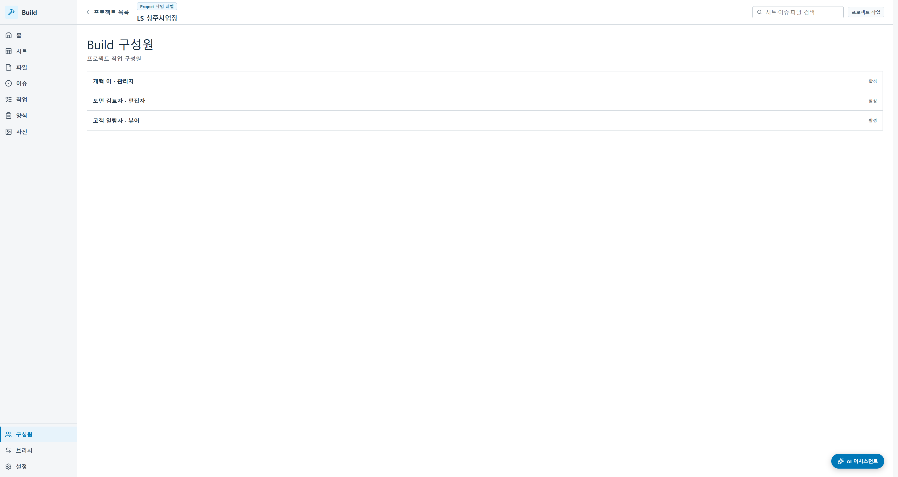

- 프로젝트 구성원 3명: **개혁 이(관리자) · 도면 검토자(편집자) · 고객 열람자(뷰어)**. 역할·활성 상태.

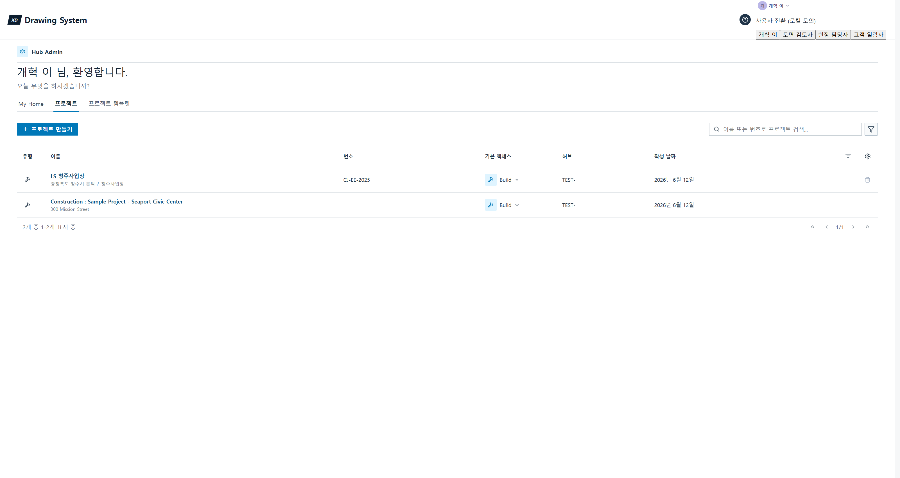

- 상단 사용자 메뉴로 **역할 전환**(개혁 이·도면 검토자·현장 담당자·고객 열람자) — 데모용 모의 사용자 전환(실 인증은 후속 과제).

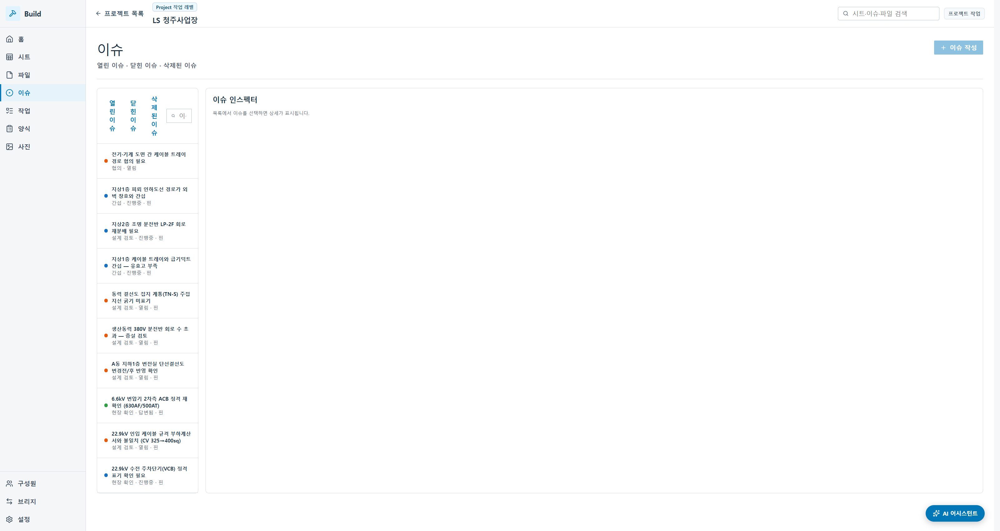

- **뷰어**로 전환하면 편집 액션이 비활성화. 예: 이슈 화면의 '이슈 작성' 버튼이 disabled + "이슈 작성 권한이 없습니다(뷰어)" 안내. 백엔드도 403으로 강제(프론트 게이팅과 이중 방어).
- **보고서 포인트:** 관리자/편집자/뷰어 3단계 권한이 UI와 API 양쪽에서 실제로 강제됩니다.

---

## 11. 전역 검색

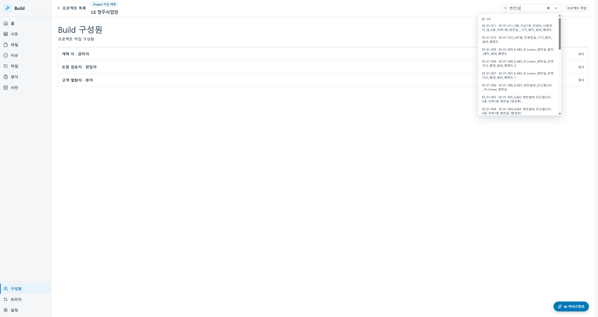

- 상단 검색창에 "변전실" 입력 → **시트·이슈·파일**을 교차 부분일치로 실시간 검색. 결과 클릭 시 해당 항목으로 딥링크 이동.
- **보고서 포인트:** 프로젝트 전체를 관통하는 통합 검색.

---

## 12. ⭐ AI 어시스턴트 — 실데이터 그라운딩

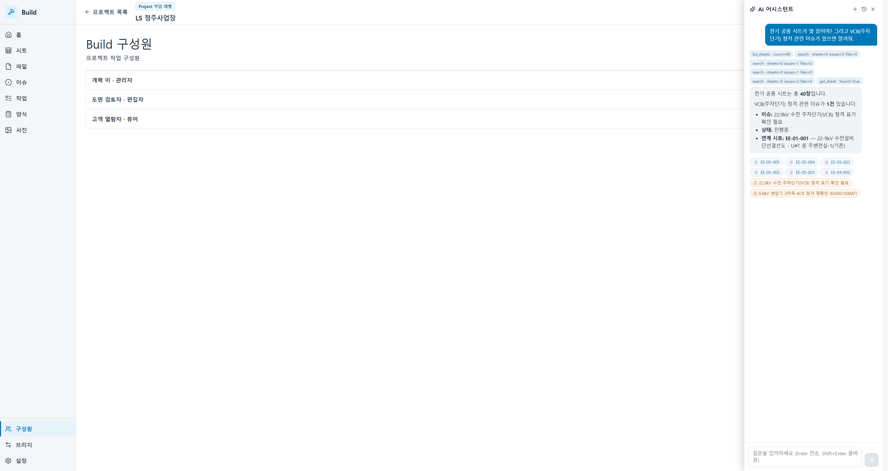

- 질문: *"전기 공종 시트가 몇 장이야? 그리고 VCB(주차단기) 정격 관련 이슈가 있으면 알려줘."*
- 실제 **GPT(gpt-5.5)**가 백엔드 도구(`list_sheets` count=40, `search`, `get_sheet`)를 스스로 호출(응답 상단 **툴 칩**으로 근거 노출)하고 답변:
  - **전기 공종 시트는 총 40장**
  - **VCB 정격 관련 이슈 1건**: "22.9kV 수전 주차단기(VCB) 정격 표기 확인 필요" · 상태 진행중 · **연계 시트 EE-01-001**
- 답변 하단 **딥링크 칩(📄 시트 / ⚠ 이슈)** 클릭 → 해당 도면/이슈로 즉시 이동.
- **보고서 포인트:** LLM이 사내 실데이터에 **근거해서** 답하고(환각 없이), 근거를 툴 콜로 투명하게 보여주며, 결과에서 원본으로 바로 점프.

### AI — 설비 온톨로지 바인딩

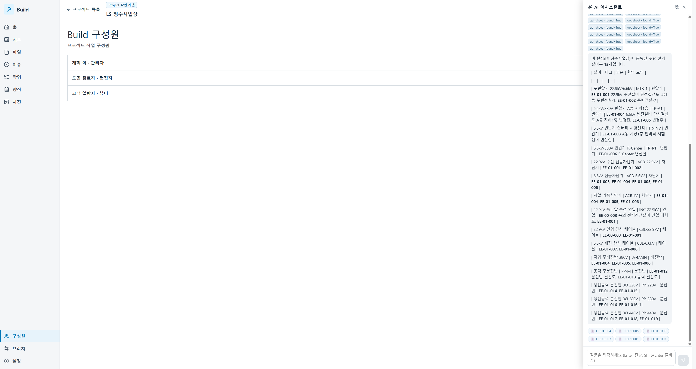

- 질문: *"이 현장에 등록된 주요 전기설비는 무엇이고, 각각 어느 도면에서 볼 수 있어?"*
- `list_equipment`(count=**15**) + 다수 `get_sheet` 호출로, **전기설비 15종을 표**로 정리하고 **각 설비 → 확인 도면**을 매핑:
  - 변압기(주변압기 22.9/6.6kV MTR-1, TR-A1, TR-INV, TR-R1) → EE-01-001·004·005·003·006
  - 차단기(22.9kV VCB, 6.6kV VCB, 저압 ACB), 인입/케이블(INC-22.9kV, CBL-22.9kV/6.6kV), 배전반(LV-MAIN), 분전반(PP-M, 220/380/440V) → 해당 결선도·평면도
- **보고서 포인트:** 단순 문서 검색을 넘어, **설비(엔티티) ↔ 도면**을 잇는 **지식 그래프(온톨로지)** 기반 질의응답. XD의 차별점.

---

## 부록 A. 화면 인덱스 (파일명 순)

| # | 파일 | 화면 | 핵심 |
|---|------|------|------|
| 01 | 01-hub-projects.png | 허브 프로젝트 목록 | LS 청주사업장 진입점 |
| 02 | 02-build-home.png | Build 홈 개요 | 실데이터 대시보드(시트40·파일40·31.2MB·이슈10) |
| 02b | 02b-build-analytics.png | Build 홈 종합 | 이슈 분석 차트 |
| 03 | 03-sheets.png | 시트 레지스터 | 청주 전기도면 40장·자동 번호추출 |
| 04 | 04-viewer-markup.png | 2D 뷰어 + 마크업 | 단선결선도·마크업 10종·필름스트립 |
| 05 | 05-viewer-issue-pins.png | 뷰어 이슈 핀 | 도면 위 좌표 핀 |
| 06 | 06-issues-list.png | 이슈 목록 | 실이슈 10건·분류/상태/핀 |
| 07 | 07-issue-detail.png | 이슈 상세 | 담당·위치·상태·핀 딥링크 |
| 08 | 08-files-folders.png | 파일/폴더 트리 | ACC식 폴더 + 전기도면 |
| 09 | 09-files-electric-drawings.png | 전기도면 폴더 | 실 PDF 40개·용량·버전 |
| 10 | 10-photos.png | 사진 갤러리 | 현장·검수 사진 4장 |
| 11 | 11-tasks.png | 작업 관리 | 실작업 6건·담당/우선순위/기한 |
| 12 | 12-forms.png | 점검 양식 | 체크리스트 4종·완료율 |
| 13 | 13-members.png | 구성원 | 관리자·편집자·뷰어 |
| 14 | 14-global-search.png | 전역 검색 | 시트·이슈·파일 교차 검색 |
| 15 | 15-ai-chat-grounding.png | AI 챗 그라운딩 | 실 GPT·툴콜·딥링크 |
| 16 | 16-ai-ontology-equipment.png | AI 온톨로지 | 설비 15종 → 도면 바인딩 |
| 17 | 17-user-switch-rbac.png | 사용자 전환 | 모의 역할 4종 |
| 18 | 18-viewer-role-gating.png | 뷰어 권한 게이팅 | 편집 액션 비활성 + 403 |

## 부록 B. 촬영 환경 / 재현

- 프론트: Vite dev `http://127.0.0.1:5173` · 백엔드 FastAPI `127.0.0.1:8000`(`XD_STORE=json`, 청주 실데이터) · AI 사이드카 `127.0.0.1:8001`(실 gpt-5.5) · TypeDB `1729`.
- 데이터 출처: `청주사업장신축/전기도면` 실 PDF 40장. 온톨로지 설비 15종은 `scripts/seed_ontology.py`로 청주 실계통 재큐레이트.
- 이전 스크린샷 세트는 `docs/product/screenshots/이전버전_2026-07-06/`(07-03 구 데이터)로 보관.
