# 시작하기 — 빈 프로젝트에서 도면관리 시작하기 (기계설비 편)

> **아무것도 없는 상태에서, 담당자가 프로젝트를 만들고 → 팀을 등록하고 → 기계설비 도면을 올려 → 실제로 일하기 시작하기까지를 화면 하나하나 따라 하는 매뉴얼입니다.**
> 이 문서의 프로젝트·담당자·도면·이슈·작업·점검표는 **설명용으로 꾸민 그림이 아니라, 시스템에 실제로 새로 만든 데이터**입니다. 화면은 그 데이터가 뜬 진짜 캡처입니다.
> **사용한 실도면**: `LS ELECTRIC R-Center 구축`의 **기계(11MB)·기계소방(4MB) PDF 2장** → 업로드·자동변환으로 **68장의 시트**가 만들어졌습니다.

---

## 이 매뉴얼이 답하는 질문

처음 시스템을 열면 대개 이렇게 막힙니다.

- "프로젝트가 하나도 없는데, 뭐부터 눌러야 하지?"
- "우리 팀원(담당자)은 어떻게 넣고, 권한은 어떻게 나누지?"
- "PC 폴더에 흩어진 도면 PDF를, 여기 어떻게 올리고 정리하지?"
- "올리고 나면 뭐가 좋아지지? 왜 이렇게 해야 하지?"

아래는 **빈 프로젝트 → 도면이 도는 프로젝트**까지의 한 바퀴입니다. 각 단계마다 **① 이렇게 합니다(방법) · ② 왜 이렇게 합니다(이유) · ③ 이래서 편합니다(편의성)** 세 가지를 같이 적었습니다.

**등장하는 담당자 (이번에 새로 등록한 구성원)**

| 이름 | 역할 | 하는 일 |
|---|---|---|
| 기계설비 담당 | 관리자 | 프로젝트 총괄·도면 반입·이슈/점검 주관 |
| 기계 CAD 담당 | 편집자 | AutoCAD 원본 수정·상세도 작성 |
| (개혁 이) | 관리자 | 프로젝트를 처음 만든 사람(자동 관리자) |

---

## STEP 0 · 출발점 — 로그인하면 보이는 첫 화면

접속하면 **허브(프로젝트 목록)** 가 뜹니다. 지금은 우리 프로젝트가 아직 없습니다.

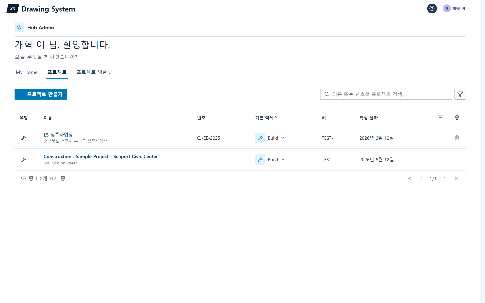
*허브 — "개혁 이 님, 환영합니다." 아래에 `프로젝트 만들기` 버튼과 프로젝트 목록이 있습니다. 여기가 모든 일의 시작점입니다.*

> 이 시스템은 **프로젝트 단위**로 도면·이슈·작업·구성원을 담습니다. 그래서 제일 먼저 하는 일은 "그릇"인 프로젝트를 하나 만드는 것입니다.

---

## STEP 1 · 프로젝트 만들기

**① 이렇게 합니다.** 좌측 상단 파란 **`+ 프로젝트 만들기`** 버튼을 누르면 작성 창이 뜹니다.

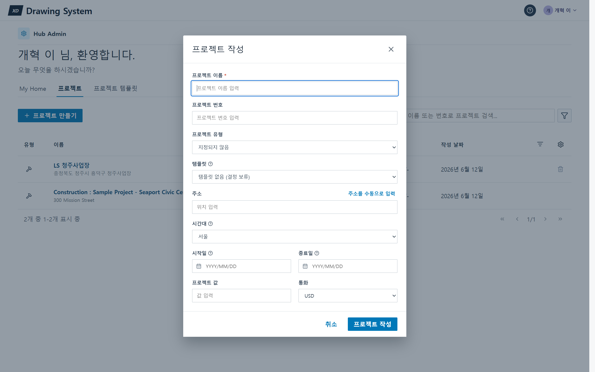
*프로젝트 작성 창 — 이름만 필수(★)이고 나머지는 선택입니다.*

**프로젝트 이름**에 `청주 R-Center 기계설비`, 번호에 `CJ-ME-2026`, 유형은 `운영관리`로 채웠습니다. **템플릿은 "템플릿 없음(결정 보류)"** 으로 두었습니다 — 말 그대로 "아무것도 없는 빈 프로젝트"로 시작하기 위해서입니다.

*이름·번호·유형·주소를 채운 모습. 아래 `프로젝트 작성`을 누르면 생성됩니다.*

**② 왜 이렇게 합니다.** 프로젝트는 도면·설비·이슈·점검이 **한 울타리 안에서** 관리되는 단위입니다. 청주의 기존 전기 프로젝트("LS 청주사업장")와 **섞이지 않게**, 기계설비는 별도 프로젝트로 시작합니다. 이름·번호를 처음에 정확히 정하면, 나중에 "이거 무슨 프로젝트였지?"가 없습니다.

**③ 이래서 편합니다.** 만든 사람이 **자동으로 '관리자'** 가 됩니다(권한을 따로 신청할 필요가 없습니다). 그리고 템플릿을 고르지 않아도 뒤에서 보듯 **기본 폴더 구조가 자동으로 깔립니다** — 백지에서 폴더부터 하나하나 만들 필요가 없습니다.

---

## STEP 2 · 담당자·구성원 등록 (권한 나누기)

프로젝트를 만들면 곧바로 **Project Admin > 구성원** 화면으로 들어옵니다. 아직 만든 사람 한 명뿐입니다.

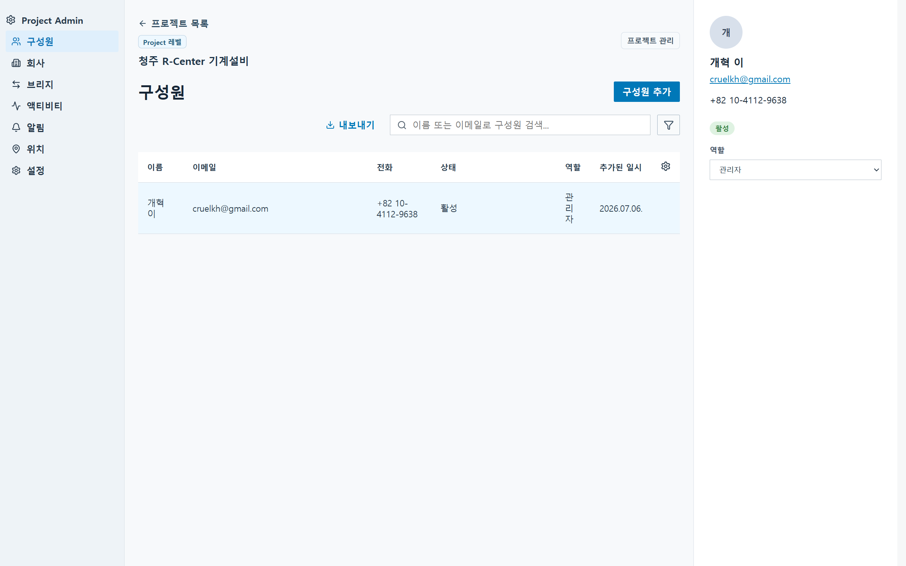
*구성원 — 만든 사람(개혁 이)이 자동으로 '관리자'로 등록돼 있습니다. 오른쪽 위 `구성원 추가`로 팀을 넣습니다.*

**① 이렇게 합니다.** `구성원 추가`를 누르고, 조직 구성원 목록에서 사람을 고른 뒤 역할을 정합니다.

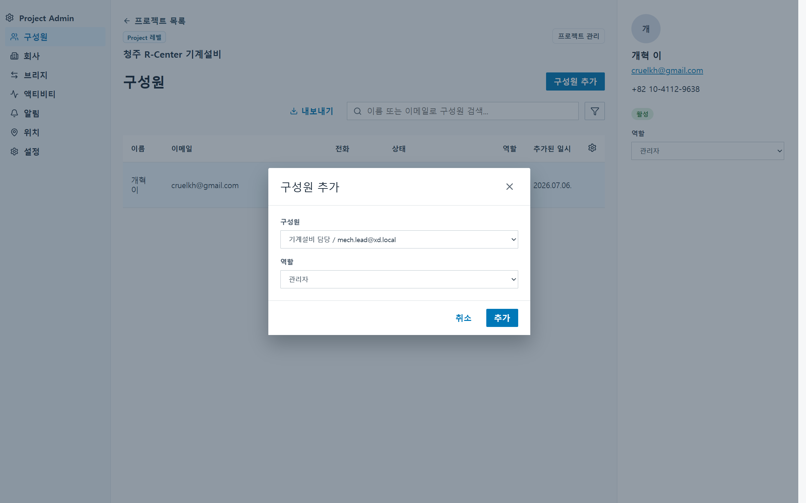
*`기계설비 담당`을 선택하고 역할을 `관리자`로 지정. 같은 방식으로 `기계 CAD 담당`은 `편집자`로 추가했습니다.*

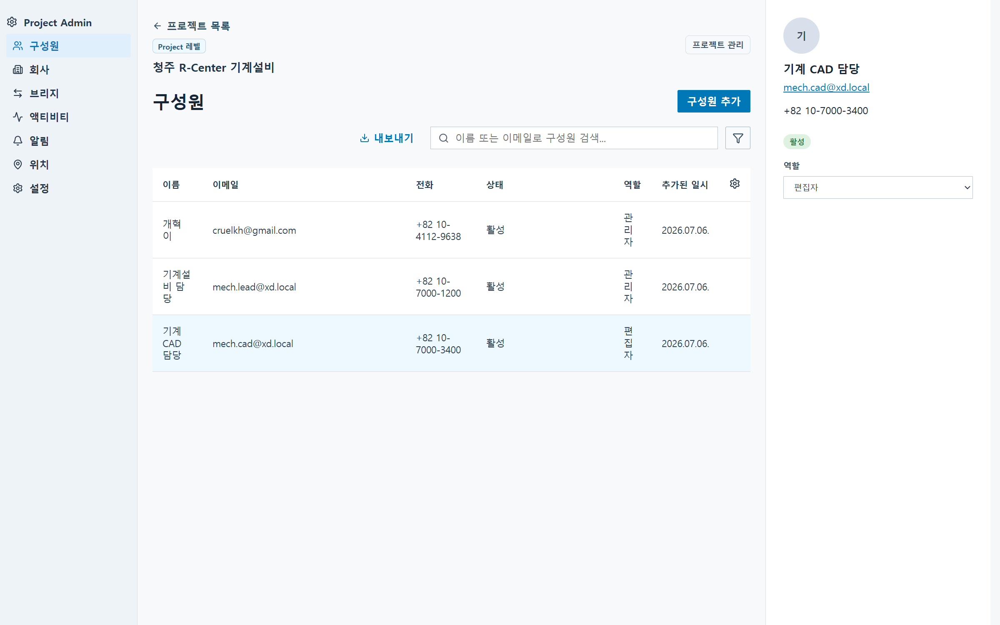
*세 명이 등록됐습니다 — 기계설비 담당(관리자)·기계 CAD 담당(편집자)·개혁 이(관리자). 상태·역할·추가 일시가 함께 남습니다.*

**② 왜 이렇게 합니다.** 도면 관리에서 가장 중요한 것은 **"누가 무엇을 바꿀 수 있는가"** 입니다. 역할은 3가지입니다.

| 역할 | 할 수 있는 일 |
|---|---|
| **관리자** | 구성원·프로젝트 설정 관리 + 아래 편집자 권한 전부 |
| **편집자** | 도면 업로드, 폴더 생성, 마크업·이슈·작업·점검표 작성 |
| **뷰어** | 열람·다운로드만 (작성·수정 불가) |

**③ 이래서 편합니다.** 권한은 **화면에서 버튼을 가리는 것으로 끝나지 않고, 서버에서도 막습니다(이중 방어)**. 예컨대 협력사를 '뷰어'로 넣으면, 그 사람은 최신 도면을 볼 수는 있어도 도면을 바꾸거나 이슈를 지울 수 없습니다 — "누가 실수로 원본을 건드리면 어쩌지?" 걱정이 사라집니다. 또한 **마지막 관리자는 강등·삭제되지 않게** 막혀 있어, 프로젝트가 주인 없이 잠기는 일이 없습니다.

---

## STEP 3 · 빈 프로젝트는 어떻게 생겼나 (정직한 빈 상태)

구성원을 넣었으니 실제 작업공간(**Build**)으로 들어갑니다. 프로젝트 목록에서 우리 프로젝트의 **`Build`** 를 누르면 됩니다. 아직 도면이 없으니, 모든 화면이 "비어 있음"을 **정직하게** 보여 줍니다.

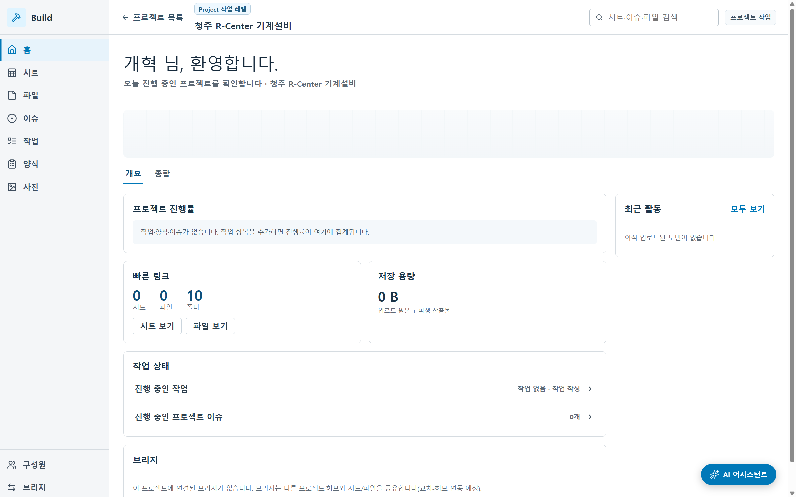
*홈 — "작업·양식·이슈가 없습니다", 시트 0 · 파일 0, 저장 0 B, "아직 업로드된 도면이 없습니다". **폴더만 10개**가 이미 준비돼 있습니다(아래 설명).*

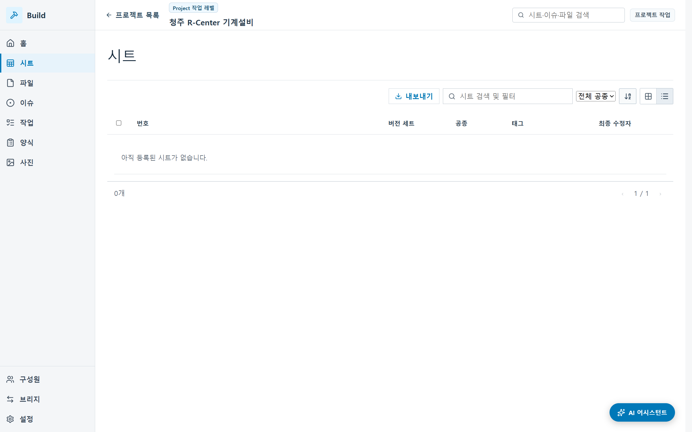
*시트 — 아직 등록된 시트가 없습니다. 도면을 올리면 여기가 자동으로 채워집니다.*

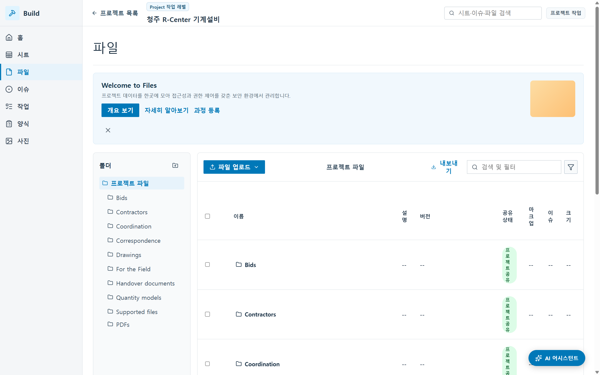
*파일 — 파일은 0건이지만, `Bids·Contractors·Drawings·PDFs` 등 **표준 폴더 구조가 이미 깔려 있습니다**. 왼쪽 `폴더` 패널과 상단 `파일 업로드` 버튼이 앞으로 쓸 도구입니다.*

**왜 "빈 상태"를 이렇게 보여 주나요?** 빈 화면에 가짜 예시 데이터를 채워 두면, 진짜 데이터와 헷갈립니다. 이 시스템은 **없으면 "없다"고 정직하게 말하고, 무엇을 하면 채워지는지 안내**합니다. 그래서 처음 쓰는 사람도 "지금 이건 진짜 우리 데이터"라고 신뢰할 수 있습니다.

---

## STEP 4 · 폴더 만들기 (도면을 담을 자리)

**① 이렇게 합니다.** 파일 화면 왼쪽 `폴더` 옆의 **폴더+ 아이콘**을 누르면 이름 입력칸이 생깁니다. `기계설비 도면`이라 적고 `추가`.

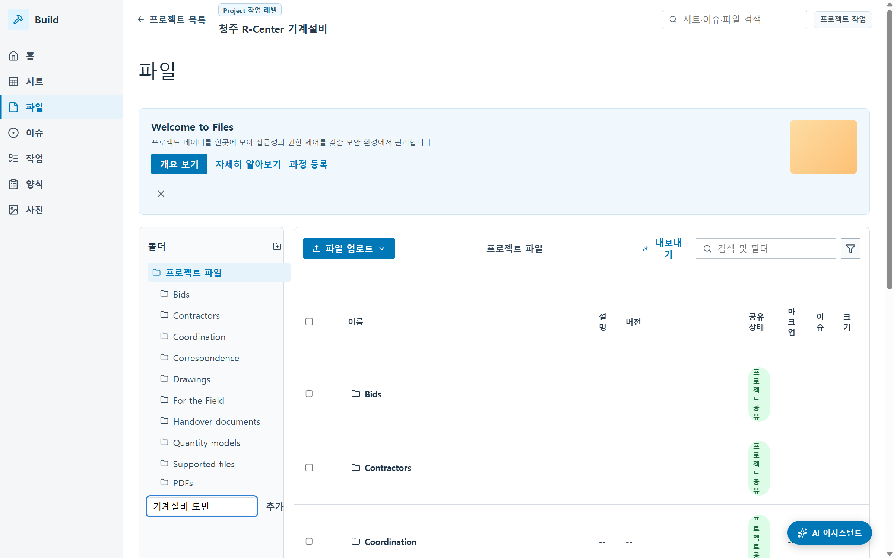
*폴더 트리 맨 아래에 `기계설비 도면` 입력칸이 열렸습니다. `추가`를 누르면 폴더가 생깁니다.*

**② 왜 이렇게 합니다.** 도면은 나중에 수십·수백 장이 됩니다. 처음에 **"기계설비 도면"처럼 업무 기준으로 자리를 만들어 두면**, 올릴 때부터 정리된 채로 쌓입니다. 기본 폴더(Drawings, PDFs 등)를 그대로 써도 되고, 우리 방식대로 새 폴더를 더해도 됩니다.

**③ 이래서 편합니다.** 폴더에는 **공유 상태(프로젝트 공유/비공개)** 가 붙고, 그 안에 올린 파일은 폴더의 공유 설정을 물려받습니다. "이 폴더는 협력사도 볼 수 있게"를 폴더 단위로 한 번에 정할 수 있습니다.

---

## STEP 5 · 도면 업로드 (PC에 흩어진 PDF를 시스템으로)

**① 이렇게 합니다.** `기계설비 도면` 폴더를 고른 상태에서 **`파일 업로드`** 를 누르고, PC의 도면 PDF를 선택합니다. 이번에는 `LS ELECTRIC R-Center 구축`의 **기계 도면**과 **기계소방 도면** 2개를 올렸습니다.

올리면 서버가 **자동으로 변환**합니다 — PDF의 각 페이지를 낱장 시트로 나누고, 화면에서 볼 수 있는 이미지를 만들고, 도면 속 정보를 읽어 시트 번호·공종을 뽑아냅니다.

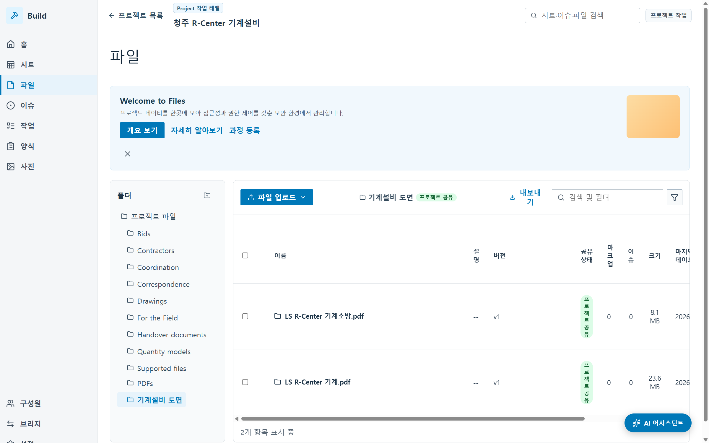
*`기계설비 도면` 폴더에 `LS R-Center 기계.pdf`(원본+파생 23.6MB)·`LS R-Center 기계소방.pdf`(8.1MB)가 v1으로 들어왔습니다. 공유 상태·버전·크기가 함께 관리됩니다.*

**② 왜 이렇게 합니다.** 지금까지 도면은 누군가의 PC, 메일 첨부, USB에 흩어져 있었습니다. "최신본이 어느 파일이지?"가 늘 문제였습니다. 시스템에 올리는 순간, **도면은 한곳에 모이고 버전으로 관리**됩니다.

**③ 이래서 편합니다.** 업로드만 하면 **사람이 손대지 않아도** 시트 분할·이미지 생성·시트번호 추출까지 끝납니다. 나중에 수정본이 나오면 같은 파일에 **새 버전**으로 올리면 되고, 이전 버전은 이력으로 남고 목록에는 항상 **최신 1건**만 보입니다.

---

## STEP 6 · 시트 레지스터 — 도면이 스스로 목록이 된다

`시트` 메뉴를 누르면, 방금 올린 PDF에서 뽑아낸 시트들이 목록으로 떠 있습니다.

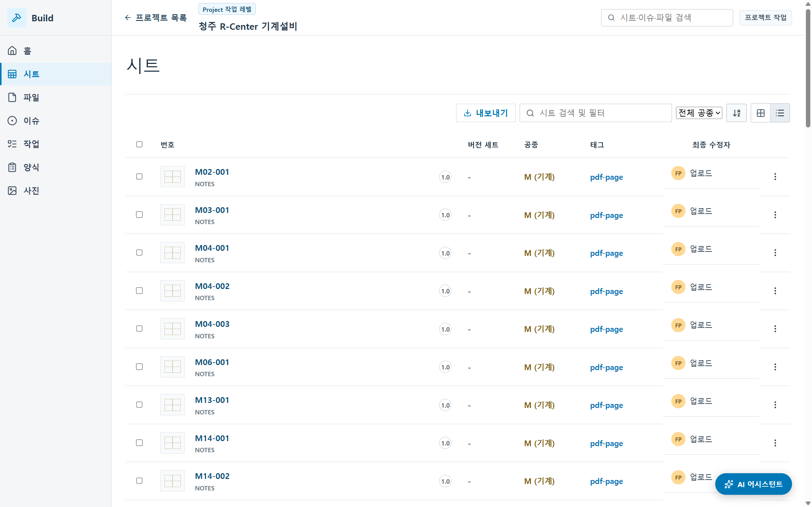
*시트 — `M02-001`, `M03-001`, `M04-001`… **시트 번호가 자동으로 추출**되고, **공종은 전부 "M(기계)"으로 자동 분류**됐습니다. 기계 53장 + 기계소방 15장 = **68장**.*

**② 왜 이렇게 합니다.** 도면 한 장 한 장을 "시트"로 다루면, 도면번호로 찾고·필터하고·낱장 단위로 이슈를 걸 수 있습니다. 파일(PDF 뭉치)이 아니라 **일하는 단위(시트)** 로 도면을 보는 것입니다.

**③ 이래서 편합니다.** 68장을 사람이 하나씩 번호 붙일 필요가 없습니다. 시스템이 **도면 속 타이틀블록을 읽어** 번호·공종을 채웁니다. 검색창에 도면번호를 치거나, 공종(기계 M) 필터로 좁히거나, 자연 정렬로 순서대로 볼 수 있습니다.

---

## STEP 7 · 2D 뷰어 — CAD 없이 브라우저에서 도면 열기

시트 목록에서 아무 시트나 누르면 **뷰어**가 열립니다.

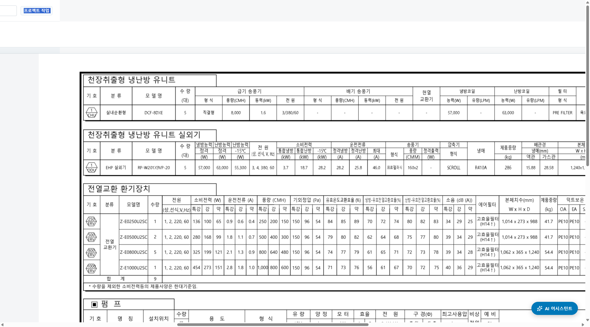
*뷰어 — 실제 기계 도면이 브라우저에서 그대로 열립니다. 이 시트는 **기계 장비 일람표**로, 천장취출형 냉난방 유니트(DCF-8DXE·8,000CMH), EHP 실외기(RP-W201X9VP-20·냉방 57,000W·냉매 R410A·SCROLL), 전열교환 환기장치(Z-E250~1000), 펌프가 사양과 함께 읽힙니다. 왼쪽에는 마크업·이슈 도구가 있습니다.*

**② 왜 이렇게 합니다.** 현장·회의에서 도면을 보려고 매번 AutoCAD를 켜고 원본 파일을 찾을 필요가 없습니다. 링크만 있으면 **브라우저에서 바로** 열고, 확대·이동하며 검토합니다.

**③ 이래서 편합니다.** 도면 위에 **검토 표시(마크업)** 를 남기면, 그 표시는 확대·축소해도 **항상 같은 위치**에 고정됩니다. "여기 이 실외기 배치 확인"이라는 의견이 말로 흩어지지 않고 도면 그 자리에 붙습니다. (참고: 원본 DWG 편집은 이 시스템이 아니라 AutoCAD의 몫입니다. 시스템은 그 앞뒤 — 요청·검토·버전·배포 — 를 관리합니다.)

---

## STEP 8 · 이슈 — 검토 의견을 '추적되는 일'로 만들기

도면을 보다 문제를 발견하면, 말로 하지 말고 **이슈**로 남깁니다.

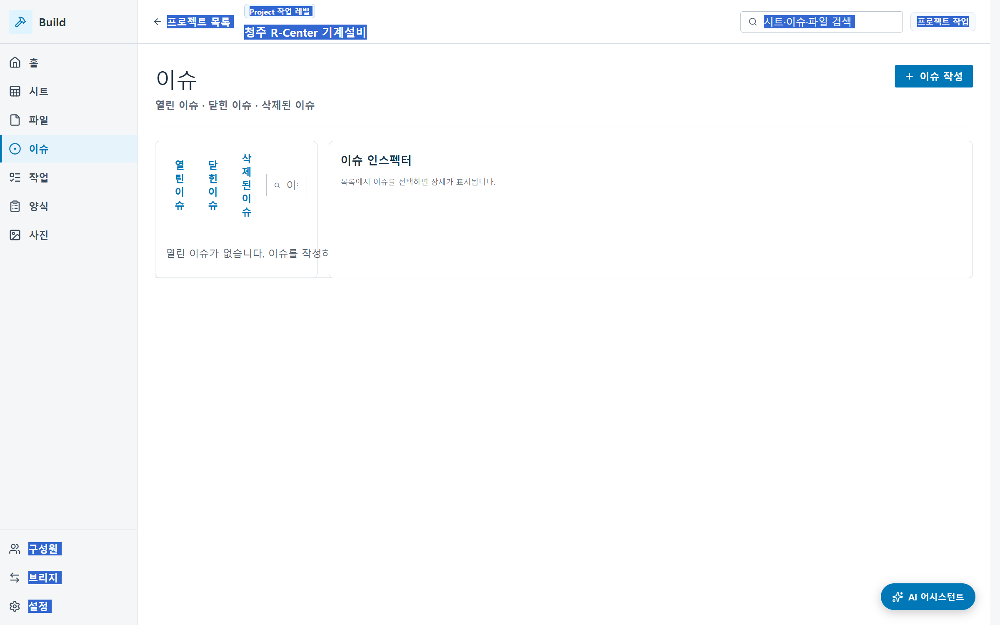
*이슈 — 아직 없습니다. `이슈 작성`으로 첫 이슈를 만듭니다.*

**① 이렇게 합니다.** `이슈 작성`을 누르고 제목·유형·담당자·설명을 적습니다.

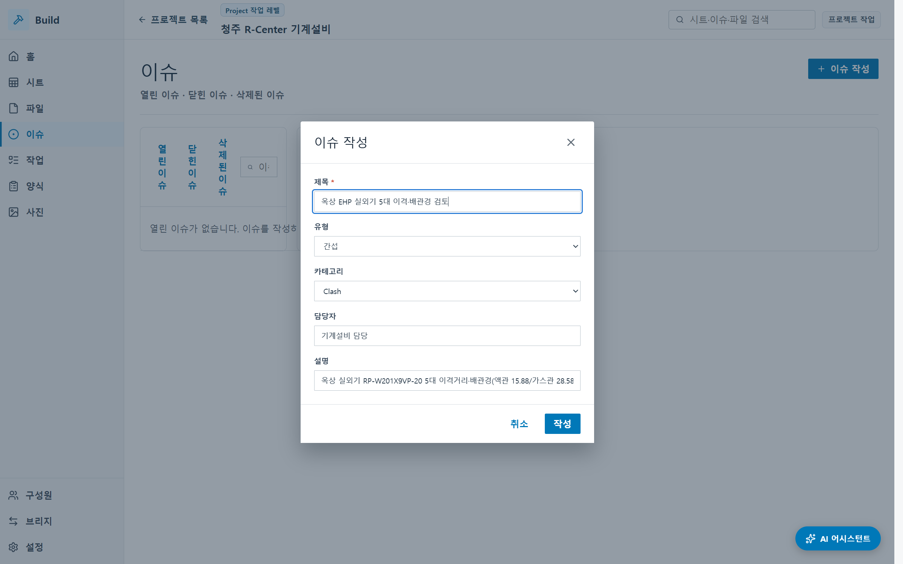
*첫 이슈: "옥상 EHP 실외기 5대 이격·배관경 검토" · 유형 `간섭` · 담당 `기계설비 담당`.*

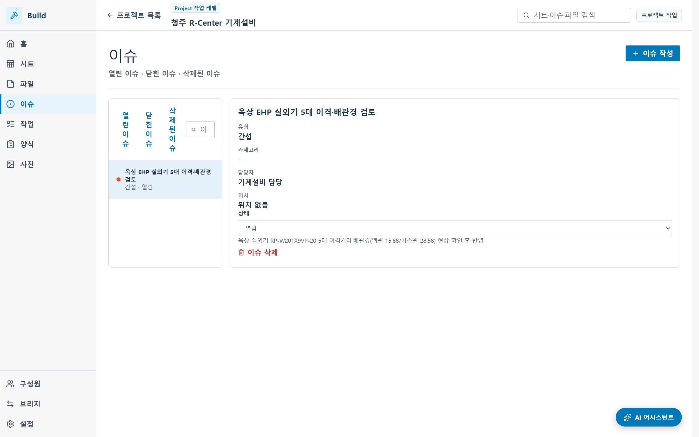
*등록된 이슈는 유형·상태(열림→진행중→답변됨→닫힘)와 함께 추적됩니다.*

**② 왜 이렇게 합니다.** "실외기 이격 확인해 주세요"를 카톡·구두로 하면 사라집니다. 이슈로 만들면 **누가·무엇을·언제까지·지금 어떤 상태인지**가 남고, 도면 위 핀으로 위치까지 묶입니다.

**③ 이래서 편합니다.** 이슈는 도면과 **양방향으로 연결**됩니다. 목록에서 도면으로, 도면 핀에서 이슈로 오갑니다. 몇 달 뒤 "이 배치 왜 이렇게 됐지?"에 이슈 이력이 답을 줍니다.

---

## STEP 9 · 작업(Task) — 할 일을 담당·기한과 함께

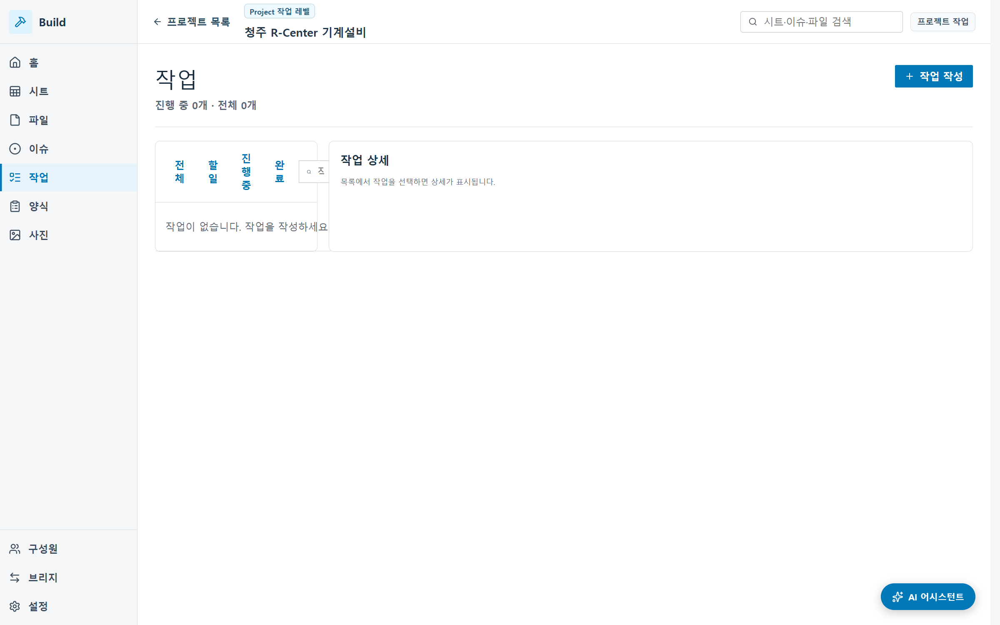
*작업 — 아직 없습니다. `작업 작성`으로 만듭니다.*

**① 이렇게 합니다.** 제목·담당자·우선순위·상태·기한을 정합니다.

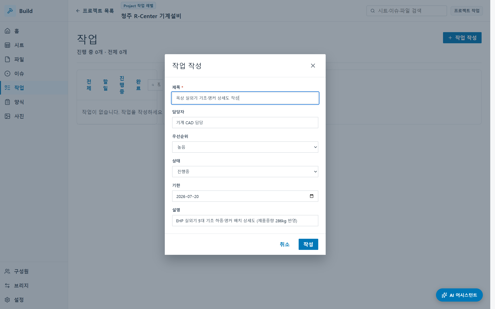
*첫 작업: "옥상 실외기 기초·앵커 상세도 작성" · 담당 `기계 CAD 담당` · 우선순위 `높음` · 진행중 · 기한 2026-07-20.*

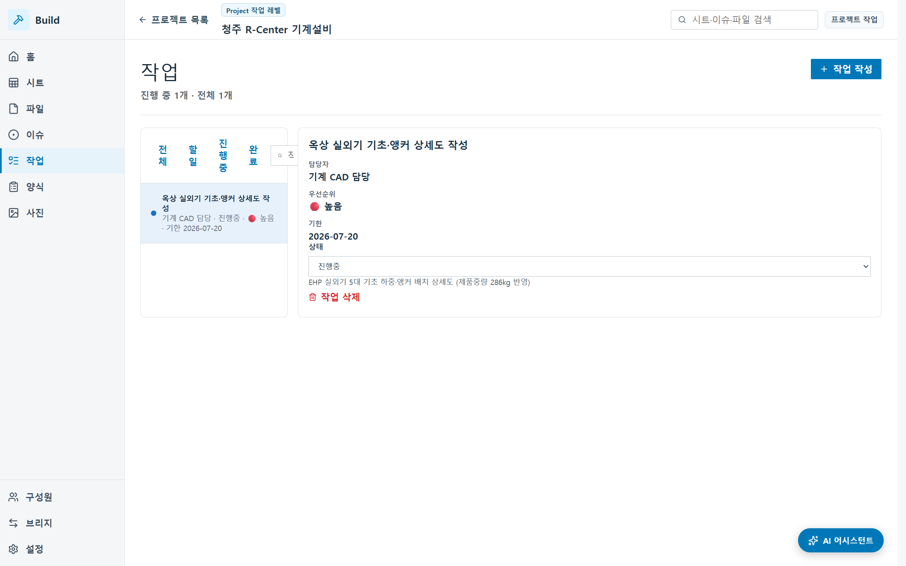
*작업이 담당·상태·기한과 함께 보드에 올라갑니다.*

**② 왜 · ③ 편의.** 이슈가 "발견한 문제"라면, 작업은 "해야 할 일"입니다. 담당과 기한이 붙으니 **누락이 줄고**, 홈 대시보드에 진행 상황이 자동 집계됩니다.

---

## STEP 10 · 양식(점검표) — 점검을 같은 기준 안에서

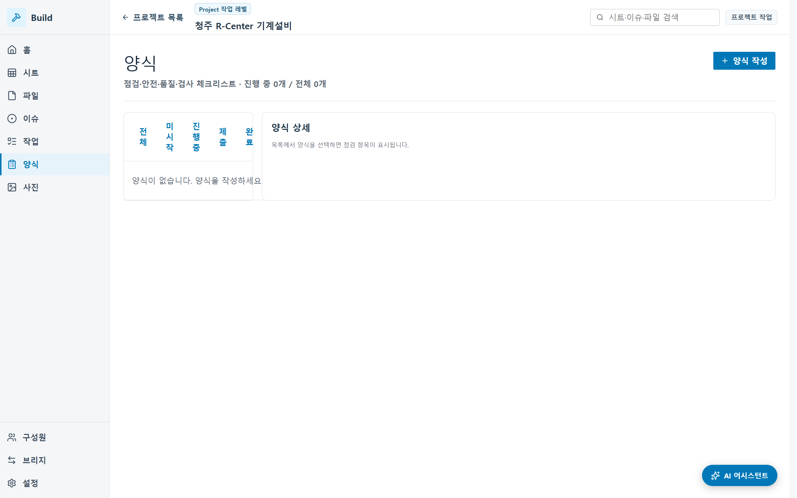
*양식 — 아직 없습니다. `양식 작성`으로 체크리스트를 만듭니다.*

**① 이렇게 합니다.** 제목·유형·항목(줄바꿈으로 여러 개)을 적습니다.

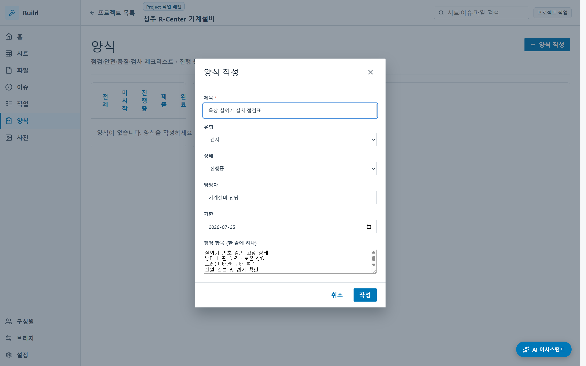
*"옥상 실외기 설치 점검표" · 유형 `검사` · 항목: 기초 앵커 고정 / 냉매 배관 이격·보온 / 드레인 구배 / 전원·접지 / 방진 패드.*

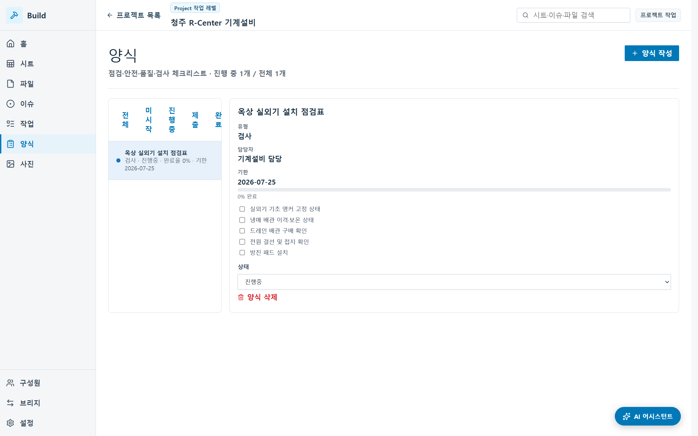
*양식이 등록되고, 항목을 체크하면 완료율이 자동 계산됩니다.*

**② 왜 · ③ 편의.** 점검이 종이나 개인 엑셀이 아니라 **도면·이슈와 같은 시스템 안**에서 이뤄집니다. 항목을 체크하면 완료율이 자동으로 나오고 홈 KPI로 집계돼, "이 설비, 인수할 때 뭘 확인했지?"에 바로 답할 수 있습니다.

---

## STEP 11 · 다시 홈 — 빈 프로젝트가 '도는 프로젝트'가 되다

처음의 빈 홈과 지금을 비교해 보세요.

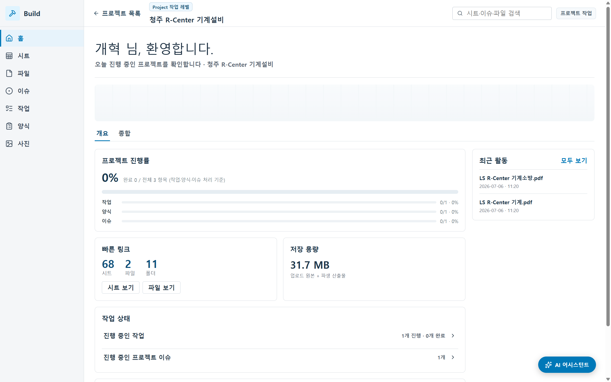
*홈 — 시트 **68** · 파일 **2** · 폴더 **11** · 저장 **31.7MB**, 진행 중 작업 1 · 이슈 1, 최근 활동에 업로드 도면 2건. 진행률(작업·양식·이슈)이 한 화면에 집계됩니다.*

| | 시작할 때 (STEP 3) | 지금 (STEP 11) |
|---|---|---|
| 시트 | 0 | **68** |
| 파일 | 0 | **2** |
| 폴더 | 10 (기본) | **11** |
| 저장 | 0 B | **31.7 MB** |
| 이슈 | 0 | **1 (진행)** |
| 작업 | 0 | **1 (진행)** |
| 점검표 | 0 | **1 (진행)** |

---

## 5분 요약 — 빈 프로젝트에서 여기까지

| 순서 | 무엇을 | 어디서 | 왜 / 편해지는 점 |
|---|---|---|---|
| 1 | 프로젝트 만들기 | 허브 `프로젝트 만들기` | 도면·설비를 담을 울타리 · 만든 사람=관리자 자동 |
| 2 | 담당자 등록 | Project Admin `구성원 추가` | 역할(관리자·편집자·뷰어)로 권한 분리 · 서버 이중 방어 |
| 3 | 빈 상태 확인 | Build 홈/시트/파일 | 없으면 "없다"고 정직하게 · 기본 폴더 제공 |
| 4 | 폴더 만들기 | 파일 `폴더+` | 도면을 업무 기준으로 분류 |
| 5 | 도면 업로드 | 파일 `파일 업로드` | 흩어진 PDF를 한곳에 · 올리면 자동 변환 |
| 6 | 시트 확인 | 시트 | 시트번호·공종 자동 추출(68장·공종 M) |
| 7 | 뷰어로 열기 | 시트 클릭 | CAD 없이 브라우저 열람·마크업 |
| 8 | 이슈 | 이슈 `이슈 작성` | 검토 의견을 추적되는 일로 |
| 9 | 작업 | 작업 `작업 작성` | 할 일을 담당·기한과 함께 |
| 10 | 양식 | 양식 `양식 작성` | 점검을 같은 기준 안에서 |
| 11 | 홈 | 홈 | 모든 진행이 한 화면에 집계 |

---

## 이 매뉴얼이 증명하는 것

빈 프로젝트에서 시작해 기계설비 도면 2장을 넣는 아주 평범한 시작을 끝까지 따라가 보면, 이 시스템이 **처음 쓰는 사람에게도 어렵지 않다**는 점이 분명해집니다.

- **시작이 쉽다** — 프로젝트 이름만 정하면 관리자 권한과 기본 폴더까지 자동으로 준비됩니다.
- **올리면 알아서 정리된다** — 도면을 올리기만 하면 68장의 시트로 분할되고 번호·공종이 자동으로 붙습니다.
- **일이 흩어지지 않는다** — 검토 의견(이슈)·할 일(작업)·점검(양식)이 도면과 같은 울타리 안에서 담당·기한·상태와 함께 추적됩니다.

> 여기까지가 "빈 프로젝트를 처음 쓰는 법"입니다. 이렇게 채워 둔 프로젝트 위에서 **하나의 공사를 처음부터 끝까지 도는 이야기**는 → [`../활용시나리오_2026-07-06/`](../활용시나리오_2026-07-06/) 문서에서 이어집니다.
