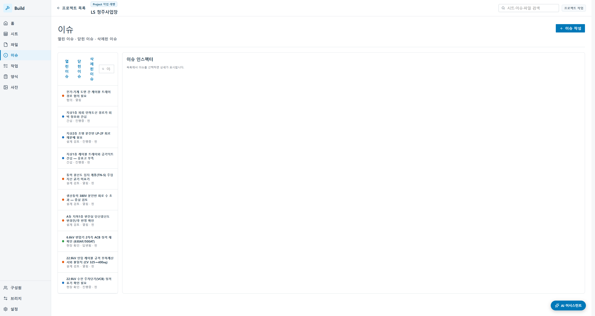
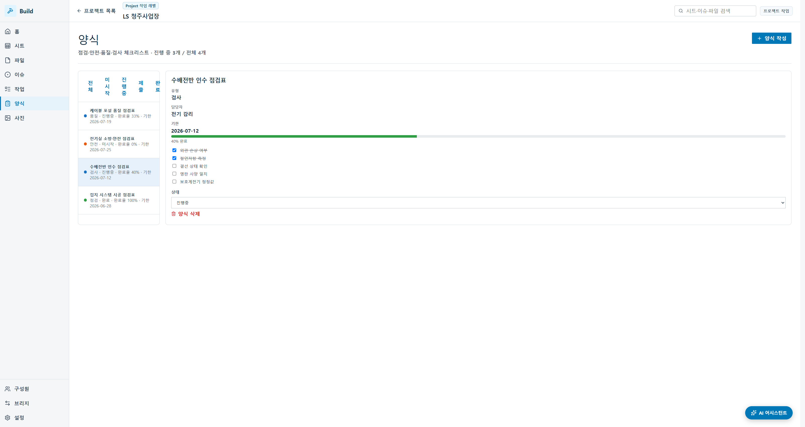

# 활용 시나리오 — 생산동력 380V 분전반(PP‑380V) 회로 증설

> **청주사업장에 실제로 등록된 40장의 전기도면·15종 설비·10건 이슈 위에서, 하나의 전기 증설 공사를 처음부터 끝까지 따라가며 도면관리시스템이 무슨 일을 하는지 보여 줍니다.**
> 이 문서의 모든 도면번호·설비 태그·이슈·점검표는 **가상 예시가 아니라 시스템에 실제 적재된 LS 청주사업장 데이터**입니다. 화면도 그 데이터가 뜬 실제 캡처입니다.

상황: A동 생산라인 증설로 3Ø 380V 동력 부하가 늘어, **생산동력 380V 분전반(PP‑380V, 도면 EE‑01‑016)에 회로를 증설**합니다. 상위 저압 주배전반(LV‑MAIN, 380V)에서 분기를 따고 간선을 포설하는, 전기 현장에서 가장 흔한 공사입니다. 이 한 바퀴가 도면 위에서 어떻게 도는지 봅니다.

---

## 등장 인물 · 권한 (시스템에 실제 등록된 구성원)

| 구분 | 역할(예) | 시스템 권한 |
|---|---|---|
| 운영 담당 | A동 전기설비 운영 | 편집자 |
| CAD 담당 | 전기설계·AutoCAD 원본 수정 | 편집자 |
| 문서관리자 | 최신본 승인·버전 관리 | 관리자 (개혁 이) |
| 협력사 | 분전반 시공 | 뷰어 (고객 열람자) |

*구성원 — 관리자·편집자·뷰어 3역할이 실제로 등록돼 있습니다. 협력사는 뷰어로 최신 시트만 조회합니다.*

**이번 공사의 대상 설비와 도면 (시스템 조회 결과 그대로)**

| 설비 태그 | 설비명 | 확인 도면 |
|---|---|---|
| PP‑380V | 생산동력 분전반 3Ø 380V | EE‑01‑016, EE‑01‑016‑1 |
| LV‑MAIN | 저압 주배전반 380V (상위) | EE‑01‑004, EE‑01‑005, EE‑01‑006 |
| — | 지상1층 전력간선·동력 평면 | EE‑02‑003 |
| — | 접지 계통 | EE‑01‑009, EE‑05‑002 |

---

## D‑1 · 출발점 — 도면은 이미 시스템 안에 최신본으로 있다

**현장에서.** 아직 공사 지시는 없습니다. 청주 A동 전력 계통은 22.9kV 수전 → 변압기 → 저압 주배전반 → 생산동력 분전반(220/380/440V)으로 구성돼 있고, 40장의 전기도면이 이미 등록돼 있습니다.

**도면관리시스템에서.** 운영 담당자는 파일이 어느 PC·어느 폴더에 있는지 기억하지 않습니다. 상단 검색창에 "분전반"이나 "380V"를 치면 관련 시트가 바로 뜹니다.

*시트 레지스터 — 청주 전기도면 40장(EE‑00‑001 ~ EE‑05‑005)이 시트번호·제목·공종·버전·최종 수정자와 함께 정리돼 있습니다. 파일명이 아니라 "분전반", "동력", "접지" 같은 업무 용어로 찾습니다.* **(실증)**

지금 목록에 보이는 것이 곧 **최신본**입니다. 같은 도면의 이전 버전은 버전 세트에 이력으로 보관되고, 목록에는 최신 1건만 나옵니다. "이게 최신 맞나?"를 누구에게도 물어볼 필요가 없습니다.

---

## D‑Day 오전 · 증설 요청 → 작업으로 등록

**현장에서.** 생산팀이 3Ø 380V 부하 증설을 요청합니다. 기존 PP‑380V에 여유 회선이 부족해 **회로를 증설**하기로 합니다.

**도면관리시스템에서.** 담당자는 아침에 프로젝트 홈을 엽니다.

*홈 — 진행률, 시트 40·파일 40·폴더 11, 저장 31.2MB, 미해결 이슈 10, 진행 중 작업이 한 화면에. 도면을 "찾으러 가기" 전에 "오늘 할 일"이 먼저 보입니다.* **(실증)**

이 증설 건을 **작업(Task)**으로 등록합니다 — 실제로 시스템에는 이미 "케이블 트레이 시공 상세도 작성"(BIM 조정자·진행중), "22.9kV 인입 케이블 발주"(구매팀·높음) 같은 청주 실작업 6건이 담겨 있습니다. 공사의 출발점이 말이나 메일이 아니라, **시스템 안의 추적 가능한 항목**으로 잡히는 순간입니다.

---

## D‑Day 오전 · 상위 계통 확인 — 어디서 따올 것인가

**현장에서.** 분전반 회로를 늘리기 전에 전기 담당자는 상위 계통을 확인합니다. ① 상위 저압 주배전반(LV‑MAIN)에 분기 여유가 있는가, ② 간선 규격·경로는, ③ 케이블 트레이 여유는, ④ 접지 계통은.

**도면관리시스템에서.** 담당자는 CAD를 켜지 않고 브라우저에서 분전반 결선도 EE‑01‑016을 바로 엽니다.

*2D 뷰어 — 실제 도면을 브라우저에서 열어 확대·이동하고, 도면 위에 검토 표시를 남깁니다. DXF 벡터는 무손실 확대되고, 마크업은 줌 배율과 무관하게 항상 같은 설비 위에 고정됩니다.* **(실증. PDF 정밀 측정·수동 축척 교정은 고도화)**

담당자는 상위 LV‑MAIN 계통(EE‑01‑006 R‑Center 변전실 단선결선도)과 지상1층 동력 평면도(EE‑02‑003)를 필름스트립으로 넘겨 가며 분기 여유와 트레이 상황을 봅니다.

---

## D‑Day 오후 · 문제 발견 — 의견을 도면 '그 자리'에 남긴다

**현장에서.** 검토 결과 세 가지가 걸립니다. ① PP‑380V 회로 수가 이미 정격에 근접해 **증설 여유 검토**가 필요하고, ② 지상1층 케이블 트레이가 급기덕트와 간섭해 **유효고가 부족**하며, ③ 동력 결선도의 **접지 계통(TN‑S) 주접지선 굵기가 미표기**입니다.

**도면관리시스템에서.** 이 판단은 실제로 시스템에 **이슈 3건으로 이미 등록돼 있습니다.**

*이슈 관리 — 청주 실이슈 10건이 분류(협의·간섭·설계 검토·현장 확인)·상태·핀과 함께 추적됩니다.* **(실증)**

- **"생산동력 380V 분전반 회로 수 초과 — 증설 검토"** (설계 검토 · 열림 · 핀)
- **"지상1층 케이블 트레이와 급기덕트 간섭 — 유효고 부족"** (간섭 · 진행중 · 핀)
- **"동력 결선도 접지 계통(TN‑S) 주접지선 굵기 미표기"** (설계 검토 · 열림 · 핀)

*이슈 상세 — 유형·카테고리·담당자·위치(도면 핀)·상태와 함께 "뷰어에서 핀 보기" 딥링크. 목록↔도면이 양방향으로 이어집니다.* **(실증)**

여기서 핵심 원리가 작동합니다. **마크업과 이슈 핀은 줌 배율과 무관하게 항상 같은 설비 위에 고정**됩니다. "회로 증설 여유 확인"이라는 의견이 정확히 EE‑01‑016의 그 자리에 머뭅니다. 검토 의견이 말로 흩어지지 않고 **도면 위치·버전·작성자와 묶여 추적 가능한 업무**가 됩니다.

---

## D+1 · 도면 개정 — 요청과 수정의 경계

**현장에서.** CAD 담당이 이슈를 확인하고 도면을 고칩니다. EE‑01‑016 분전반 결선도에 증설 회로와 주회로 차단기를 반영하고, 상위 간선·접지선 굵기를 갱신합니다.

**도면관리시스템에서.** 여기가 시스템의 **경계이자 원칙**입니다. **원본 DWG 편집은 시스템 안에서 하지 않습니다.** CAD 담당은 AutoCAD에서 원본을 수정하고, 시스템은 그 앞뒤 — 누가 요청했고(이슈), 지금 누가 수정 중이며(상태 "진행중"), 그 결과가 어떻게 등록·배포되는가 — 를 관리합니다. **(원본 편집 = 범위 밖 / AutoCAD의 몫)**

---

## D+2 · 개정본 등록·배포 — 새 버전이 최신본이 되다

**현장에서.** 수정된 개정본을 문서관리자(개혁 이·관리자)가 검토·승인합니다.

**도면관리시스템에서.** 수정된 파일을 새 버전으로 올리면 서버가 자동 변환하고 시트를 다시 추출합니다.

*파일·폴더·버전 — '전기도면' 폴더에 청주 실 PDF 40장이 용량·버전·최종 수정자(전기설계팀)와 함께 관리됩니다. 새 버전을 올리면 이전 버전은 버전 세트 이력으로 내려가고 목록에는 최신 1건만 보입니다.* **(실증. 저장소·백업·배포 정책은 구축 단계)**

문서관리자가 승인하는 순간, EE‑01‑016의 최신본은 개정본으로 바뀌고 — 운영자도, 협력사도, 이제부터 같은 최신본을 봅니다.

---

## D+3~D+5 · 시공 — 협력사는 최신본만

**현장에서.** 협력사가 상위 분기에서 간선을 포설하고 PP‑380V에 회로를 증설합니다.

**도면관리시스템에서.** 협력사는 **뷰어 권한**만 부여받습니다.

*뷰어 권한 — 협력사(고객 열람자)로 전환하면 '이슈 작성' 등 편집 액션이 "권한이 없습니다(뷰어)"로 비활성화되고, 서버에서도 403으로 막습니다. 화면만 가리는 게 아니라 서버가 함께 막는 이중 방어입니다.* **(실증. 사내 계정·SSO·감사 로그 보존은 구축 단계)**

시공 중 발견한 트레이 간섭은, 협력사가 그 위치에 "현장 확인" 유형 이슈로 남겨 담당자에게 넘깁니다. 현장의 목소리가 다시 도면 위치로 돌아옵니다.

---

## D+5 · 점검·검사 — 판넬을 넘겨받는 마지막 관문

**현장에서.** 신설 회로를 인수하기 전, 절연저항·접지저항·결선·차단기 정격을 점검합니다.

**도면관리시스템에서.** 담당자는 점검 **양식(체크리스트)**을 사용합니다 — 시스템에는 이미 청주 실 점검표 4종이 있습니다.

*양식 — "수배전반 인수 점검표"(검사·진행중·40%), "접지 시스템 시공 점검표"(점검·완료·100%), "케이블 포설 품질 점검표"(품질·진행중·33%), "전기실 소방·안전 점검표"(안전·미시작). 항목을 체크하면 완료율이 자동 산출되고 홈 종합 탭 KPI로 집계됩니다.* **(실증)**

점검이 종이나 개인 엑셀이 아니라 **도면·이슈와 같은 기준 안에서** 이뤄지므로, 나중에 "이 회로, 인수할 때 뭘 확인했지?"에 바로 답할 수 있습니다.

---

## D+6 · 완료 — 최신본 확정, 도면에 남는 이력

**현장에서.** 시공·점검이 끝나고 증설 회로가 정상 가동됩니다.

**도면관리시스템에서.** 관련 이슈·작업이 닫히고, EE‑01‑016 최신본이 확정됩니다.

*홈 종합 — 이슈 처리 추이와 양식 완료율이 수치로 집계됩니다. 외부 라이브러리 없이 인라인 SVG/CSS로 그려 로컬 환경에서 그대로 뜹니다.* **(실증)**

몇 달 뒤 담당자가 바뀌어 "왜 이 회로가 증설됐지?"라고 물으면, 답이 도면 안에 통째로 남아 있습니다. **어느 요청(작업)에서 시작해 → 어떤 검토 의견(이슈·마크업)이 있었고 → 누가 도면을 고쳤으며(개정 이력) → 언제 배포됐고(버전 세트) → 인수 때 무엇을 점검했는지(양식)**가 하나로 이어집니다. 회로 하나가 늘어나는 과정이, 그대로 **공장의 운영 지식 자산**으로 축적됩니다.

---

## 이 시나리오를 한 장으로

| 단계 | 현장 | 시스템 | 화면 | 실제 데이터 근거 |
|---|---|---|---|---|
| D‑1 | 기존 380V 계통 운용 | 최신 시트 검색·조회 | 시트·뷰어 | EE‑01‑016 외 40장 |
| D‑Day 오전 | 380V 증설 요청 | 작업 등록·홈 집계 | 홈·작업 | 실작업 6건 |
| D‑Day 오전 | 상위 계통 검토 | 뷰어 확대·레이어·필름스트립 | 2D 뷰어 | EE‑01‑006·EE‑02‑003 |
| D‑Day 오후 | 회로여유·트레이·접지 문제 | 마크업+이슈 3건 | 뷰어·이슈 | 실이슈(증설·간섭·접지) |
| D+1 | 도면 개정(원본) | 이슈로 요청·상태 추적 | 이슈 | 원본=AutoCAD(범위 밖) |
| D+2 | 개정본 승인 | 새 버전→자동변환→버전세트 | 파일·버전 | 40 PDF 버전세트 |
| D+3~5 | 협력사 시공 | 뷰어 권한(이중방어)·현장 이슈 | 구성원·이슈 | 뷰어 403 게이팅 |
| D+5 | 인수 점검 | 양식 체크리스트·완료율 | 양식 | 실점검표 4종 |
| D+6 | 완료 | 최신본 확정·이력 자산화 | 홈·종합 | 진행률·KPI 집계 |

---

## 이 시나리오가 증명하는 것

회로 하나를 늘리는 평범한 공사를 끝까지 따라가 보면, 도면관리시스템이 약속하는 세 가지가 분명해집니다.

- **최신본은 하나다** — 운영자·CAD·협력사가 버전 세트 위에서 같은 최신본을 봅니다. "이거 최신 맞아?"가 사라집니다.
- **의견은 사라지지 않는다** — "증설 여유 확인"이라는 판단이 도면 위치(EE‑01‑016)에 고정되어, 이슈 → 개정 → 확인 → 종료까지 추적됩니다.
- **과정이 자산이 된다** — 회로가 왜, 어떻게 늘었는지가 도면 안에 남아, 담당자가 바뀌어도 운영 지식으로 축적됩니다.

그리고 이 모든 것 위에, LS사우타는 청주사업장의 도면 체계·설비 태그·보안 정책에 맞춘 **맞춤 SI 구축**을 더합니다. 표준 기능이 "회로 증설이 도면 위에서 돌게" 만든다면, 맞춤 구축은 "그 흐름이 청주의 실제 설비·조직·보안 안에서 돌게" 만드는 일입니다.

> 그리고 이 한 바퀴는, 다음 증설·현장 이슈가 생기면 **같은 최신본 위에서 다시 한 바퀴** 돕니다. 도면관리가 한 번 구축하고 끝나는 결과물이 아니라 **살아 있는 운영 체계**인 이유입니다.
> **이 수동 루프를 AI가 어떻게 몇 초로 접는지는 → [`02_AI활용시나리오_비전.md`](02_AI활용시나리오_비전.md)**
