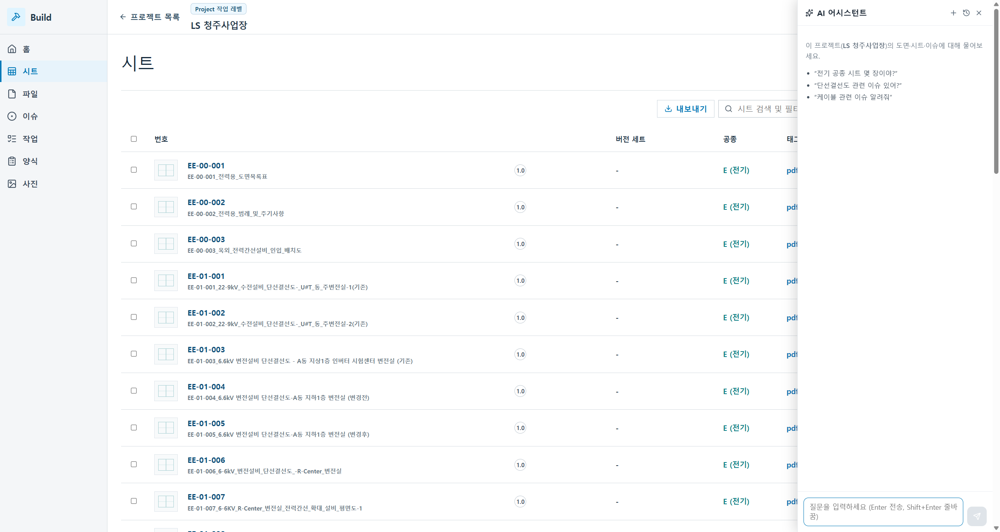
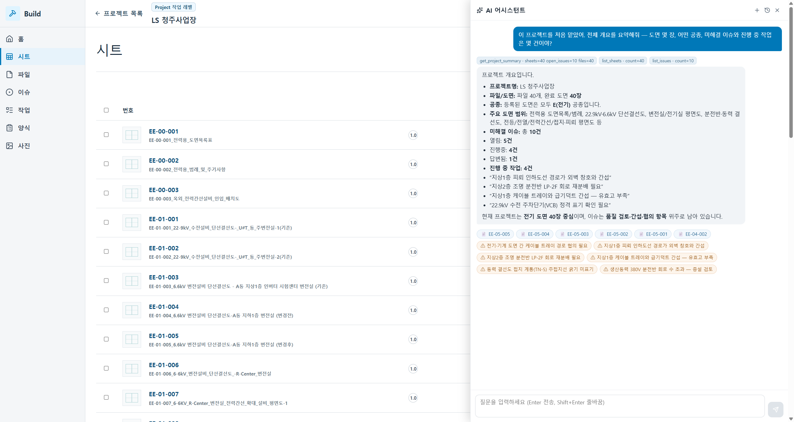
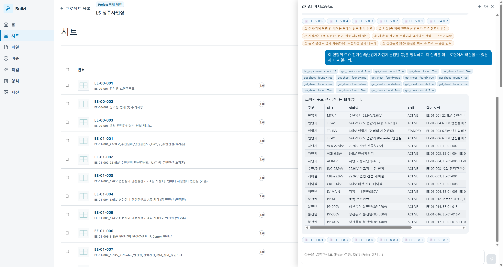
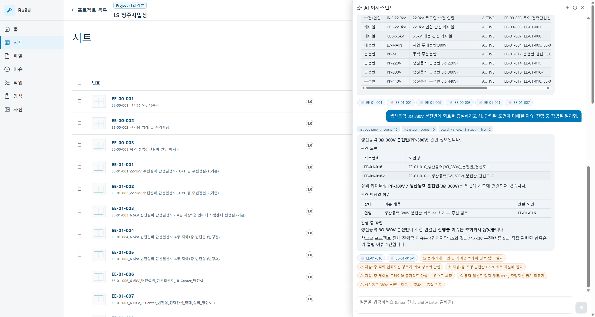
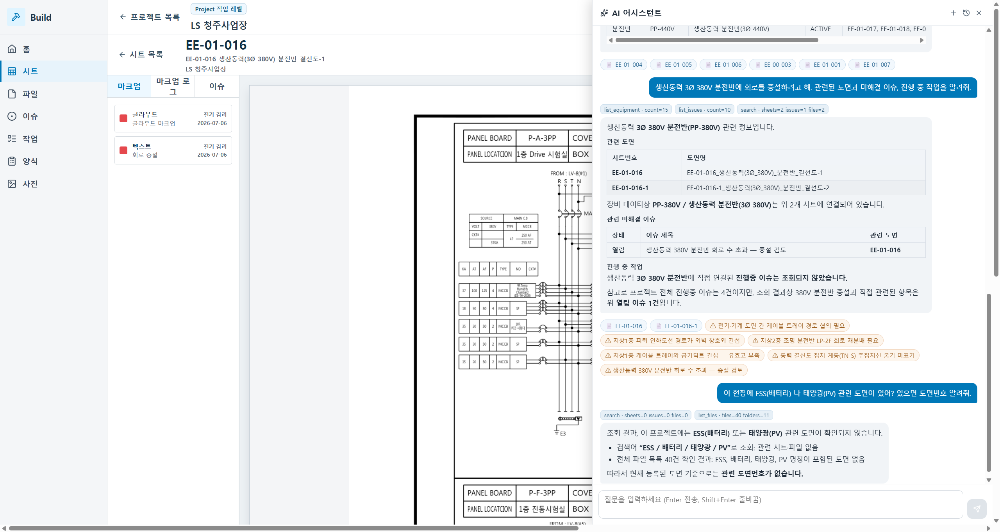
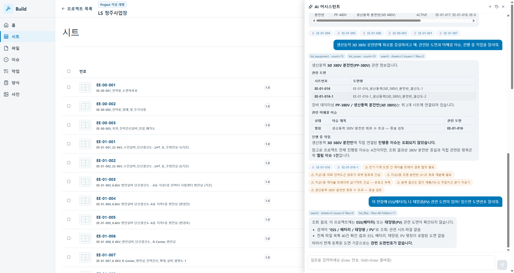

# AI 활용 시나리오 — 도면에게 "물어보는" 도면관리

> **단순 도면 뷰어와 XD가 결정적으로 갈라지는 지점.** 운영자가 도면을 뒤지는 대신 **자연어로 묻고**, AI가 청주 실도면·설비·이슈에 **근거해서(그라운딩)** 답하고, 답에서 **바로 그 도면으로 점프**합니다.

---

## 먼저, 두 가지를 정직하게 밝힙니다 (과장하지 않는 것이 출발점)

**① 이 AI는 "이미 동작"합니다 — 목업이 아닙니다.**
이 문서의 모든 화면은 **실제 대규모언어모델(gpt‑5.5)**이 **청주사업장 실데이터(도면 40장·설비 15종·이슈 10건)**에 그라운딩해 답한 **실제 캡처**입니다. AI는 스스로 도구(도면 조회·이슈 조회·설비 조회·검색)를 호출하고, 그 근거를 답변 위에 **툴 칩**으로 투명하게 드러냅니다. 지어내지 않습니다(뒤 §4 환각 검증).

**② 그럼에도, 본 제안의 "본선"은 도면관리입니다. AI는 5단계 지능화 옵션입니다.**
통합제안서 §9의 단계별 로드맵에서 AI는 **도면관리 본선이 자리 잡은 뒤 고객 우선순위에 따라 붙이는 후속 확장(5단계 옵션)**입니다. 외부 LLM 호출·온톨로지 그래프 실운영은 고객 보안 정책·데이터 반출 기준을 확정한 뒤 켭니다. 즉 **"할 수 있다"가 아니라 "이미 해 놨고, 켜는 시점만 고객과 정한다"**가 이 문서의 위치입니다.

**격리·안전 설계 (이미 구현):**
- AI는 **격리된 사이드카(별도 서버)**로 돕니다. 도면관리 본선 코드(8000)는 **한 줄도 건드리지 않습니다** — 언제든 AI만 꺼도 본선은 그대로입니다(킬 스위치).
- AI는 **읽기 도구만** 씁니다(조회·검색). 쓰기(이슈 생성·상태 변경)는 **AI가 제안 → 사람이 확인 카드에서 [실행]** 하는 휴먼‑인‑더‑루프로 설계했습니다(로드맵 §5).
- 데이터는 고객 로컬 서버에 두고, LLM 호출 여부·범위는 게이트로 통제합니다.

---

## 같은 공사, AI로 하면 — 380V 분전반 증설 (수동 시나리오의 AI 버전)

[`01_활용시나리오_생산동력380V분전반_증설.md`](01_활용시나리오_생산동력380V분전반_증설.md)의 수동 루프를, AI에게 물어 몇 초로 접습니다. 화면은 앱 어디서나 우측 하단 **AI 어시스턴트**를 열면 됩니다.

*드로어는 "이 프로젝트(LS 청주사업장)의 도면·시트·이슈에 대해 물어보세요"로 시작합니다. 프로젝트 스코프가 이미 잡혀 있어, 매번 무엇을 검색할지 지정할 필요가 없습니다.*

### ① 신임 담당자가 현장을 3초에 장악한다

새로 배치된 담당자가 묻습니다 — *"이 프로젝트를 처음 맡았어. 도면 몇 장, 어떤 공종, 미해결 이슈와 진행 중 작업은?"*

*AI가 `get_project_summary`·`list_issues` 도구를 스스로 호출(툴 칩)하고 답합니다 — **도면 40장, 모두 E(전기) 공종, 미해결 이슈 10건(열림 5·진행중 4·답변됨 1), 진행 중 작업 4건.** 주요 이슈를 추려 주고, 하단 딥링크 칩(📄시트·⚠이슈)으로 바로 이동합니다.*

수동으로는 홈·시트·이슈·작업 네 화면을 오가야 얻던 그림을, 한 번의 질문으로 요약받습니다.

### ② 전기 계통을 표로 — 설비↔도면 지식 그래프

*"주요 전기설비(변압기·차단기·분전반)를 정리하고, 각 설비를 어느 도면에서 볼 수 있는지 표로 알려줘."*

*AI가 `list_equipment`(15종)를 조회하고, 각 설비를 `get_sheet`로 확인해 **설비 → 확인 도면**을 표로 매핑합니다 — 주변압기 MTR‑1→EE‑01‑001/002, 22.9kV VCB→EE‑01‑001/002, 저압 주배전반 LV‑MAIN→EE‑01‑004~006, 생산동력 분전반 PP‑220/380/440V→EE‑01‑014~019 … 단순 문서 검색이 아니라 **설비(엔티티)를 축으로 도면을 잇는 지식 그래프(온톨로지)** 질의입니다.*

### ③ "증설하려는데" — 관련 도면·이슈·작업을 한 번에

수동 시나리오의 핵심 판단을, 담당자는 이렇게 묻습니다 — *"생산동력 3Ø 380V 분전반에 회로를 증설하려고 해. 관련된 도면과 미해결 이슈, 진행 중 작업을 알려줘."*

*AI가 설비·이슈·검색을 조합해 답합니다 — **관련 도면: EE‑01‑016·EE‑01‑016‑1(생산동력 380V 분전반 결선도), 관련 미해결 이슈: "생산동력 380V 분전반 회로 수 초과 — 증설 검토"(열림, EE‑01‑016).** 진행 중 작업은 "직접 연결된 항목 없음"이라고 정직하게 답합니다. 도면·이슈·작업 세 화면을 뒤질 일을, 한 질문이 대신합니다.*

### ④ 답에서 곧장 도면으로 — 근거로 점프

AI 답변의 📄 칩을 누르면 그 도면이 바로 열립니다.

*AI가 추천한 `📄 EE‑01‑016` 칩을 클릭하니 **실제 분전반 결선도(PANEL BOARD P‑A‑3PP, 1층 Drive 시험실, MCCB 회로표)가 "회로 증설" 마크업과 함께** 열립니다. AI 답변은 우측에 그대로 유지됩니다. "묻고 → 근거 도면으로 이동 → 그 자리에 마크업·이슈"가 끊김 없이 이어집니다.*

---

## 왜 믿을 수 있나 — 근거 투명성과 환각 방지

AI 도면 도구의 가장 큰 리스크는 **그럴듯한 거짓(환각)**입니다. XD의 AI는 두 장치로 이를 막습니다.

**근거를 숨기지 않는다.** 모든 답변 위에는 AI가 실제로 호출한 도구와 결과가 **툴 칩**으로 붙습니다(`get_project_summary · sheets=40 open_issues=10`, `list_equipment · count=15`, `get_sheet · found=True` …). 답이 어느 데이터에서 나왔는지 사람이 즉시 검증할 수 있습니다.

**없는 것은 없다고 답한다.** *"이 현장에 ESS(배터리)나 태양광(PV) 도면 있어?"* 라고 물으면 —

*AI는 검색·전체 파일 조회(40건)를 수행한 뒤 **"ESS/태양광 관련 도면이 확인되지 않습니다"**라고 정직하게 답합니다. 없는 도면번호를 지어내지 않습니다. 청주에 실제로 없는 설비를 물어도 환각 0.*

이 정직성은 도면관리 AI의 신뢰 기준선입니다 — 틀린 도면번호 하나가 현장에서 오시공으로 이어지기 때문입니다.

---

## 로드맵 — "묻는" AI에서 "일하는" AI로

지금 실증된 것은 **읽기(조회·검색·요약)**입니다. 다음 단계는 사람이 통제하는 **쓰기**입니다.

| 단계 | 내용 | 상태 |
|---|---|---|
| P1 | 앱 내 대화형 조회·요약·딥링크 (그라운딩) | **실증 완료** |
| P2 | 안전: 사이드카 격리·읽기전용·킬스위치·근거 투명성 | **실증 완료** |
| P3 | AI가 이슈·작업을 **제안** → 사람이 [실행] (휴먼‑인‑더‑루프) | 설계 완료·구현 예정 |
| P4 | 사내 계정·권한(RBAC)에 묶인 AI 액션·감사 로그 | 구축 |
| P5 | MCP 등 외부 에이전트 연동·알림(이메일 등) | 옵션 |

핵심 원칙은 변하지 않습니다 — **AI는 제안하고, 실행은 사람이 확인 카드에서 승인**합니다. 도면·이슈를 AI가 몰래 바꾸는 일은 없습니다.

---

## 단순 뷰어와의 결정적 차이

| | 단순 도면 뷰어 | **XD (AI 옵션 켠 상태)** |
|---|---|---|
| 도면 찾기 | 폴더·파일명 탐색 | **자연어 질문 → 근거 도면 딥링크** |
| 계통 파악 | 도면을 한 장씩 열어 확인 | **설비↔도면 표를 즉시 생성(온톨로지)** |
| 증설·영향 검토 | 도면·이슈·작업 화면을 오감 | **한 질문에 관련 도면·이슈·작업 취합** |
| 신뢰성 | — | **근거 툴 칩 + 없으면 "없음"(환각 방지)** |
| 안전 | — | **격리 사이드카·읽기전용·킬스위치·휴먼인더루프** |
| 데이터 | — | **고객 로컬·반출 통제·LLM 호출 게이트** |

> 요약: **"AI 도면관리를 하겠다"가 아니라, "이미 청주 실데이터로 해 놓았고, 켜는 시점과 범위만 고객과 함께 정한다."** 그것이 이 문서가 통합제안서 §9(5단계 옵션)와 어긋나지 않으면서도, 단순 뷰어와 XD를 결정적으로 가르는 이유입니다.
